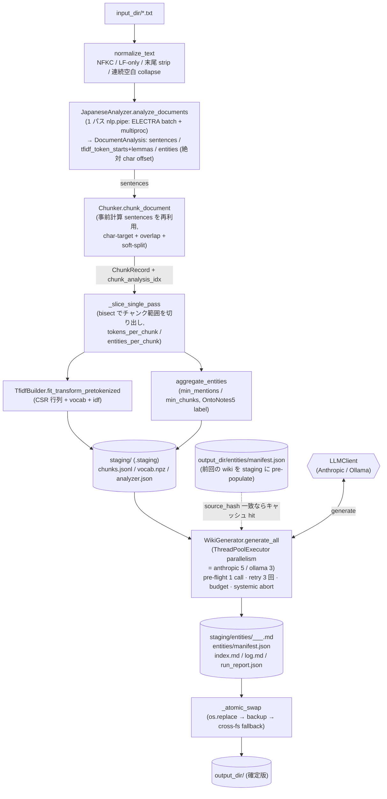
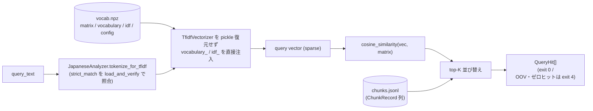

# lorebook-chunker — 日本語 RAG 向けチャンク化 + TF-IDF + 固有名詞 Wiki CLI

> **本スクリプトのアイデンティティ**
> RAG 用コーパスの前処理・健全性・一級エンティティ知識ベース生成ツールです。
> `query` サブコマンドはコーパス整形時の確認用 (TF-IDF コサイン類似度ベースのベースライン) であって、本番運用の検索ではありません。本番検索は下流の vector store / 検索基盤で行う前提です。

## できること

3 つのサブコマンドを提供します:

- **`ingest`**: `.txt` ファイル群 → チャンク化 + TF-IDF 疎ベクトル + キーワード + 固有名詞 wiki (LLM 要約) を一括生成
- **`query`**: 保存済み TF-IDF 語彙でクエリ文をベクトル化し、コサイン類似度で上位 K チャンクを返す (ベースライン検索、本番用途ではない)
- **`lint`**: コーパスの健全性 (空/重複/縮退チャンク、孤立 wiki、表記近似エンティティ) をチェック

---

## 設計ハイライト

日本語 RAG 前処理でつまずきやすい層 (分かち書き / POS / NER の再現性、破壊的再生成時の LLM コスト爆発、pipeline の途中失敗耐性) を以下の契約で押さえています。詳細は後述の各セクションに分散記載。

- **単一パス ELECTRA** (`analyzer.analyze_documents`): 文境界 + TF-IDF lemma + 絶対 char offset 付き entity を 1 回の `nlp.pipe` で同時回収. 旧 2 パス実装比で **NLP 時間 -53.6%** (10 ファイルで 23.17s → 10.75s, commit ログ実測)。
- **決定論と再現性**: `chunk_id` は `sha256(posix_path + char offset + text)` の先頭 12 桁で、破壊的全再生成後も同一入力なら同一 ID。`analyzer.json.strict_match` に Ginza モデル checksum / Sudachi 辞書 SHA-256 / 正規化契約を焼き込み、`query` / `lint` / 再 `ingest` で `AnalyzerVersionMismatchError` として fail-fast 検出。
- **破壊的全再生成 + source_hash キャッシュ**: 毎回 `<output_dir>.staging/` で作り直して `os.replace` で atomic swap。差分 ingest はあえて提供せず、高コストな LLM 呼出だけを `source_hash`(entity テキスト + analyzer ハッシュ + prompt version) 一致でスキップ。運用モデルがシンプルで状態管理の罠が少ない。
- **LLM 予算 / 信頼性**: pre-flight 1 call で疎通確認 (budget 外)、`LLMRetryableError` は 3 回 retry、failure ratio > 50% で systemic abort → `exit 6` + `.failed/` に manifest 退避。per-backend 既定並列度 (Anthropic 5 / Ollama 3) + `threading.Lock` 付き manifest write。
- **観測可能性 / エージェント連携**: 各 phase を `ProgressReporter` で stderr 出力 (TTY は単一行更新 / 非 TTY は行追記)、`run_report.json` (schema v1) と `--format json` でサマリを stdout に、`log.md` に LLM トークン累計まで記録。`query` は OOV / ゼロヒットを `exit 4` で成功ゼロ件と区別。
- **責務の絞り込み**: 本番検索は下流 vector store 前提。TF-IDF `query` は **コーパス整形時の確認用ベースライン** と identity banner に明記し、embedding / BM25 / vector DB 書き込みは対象外として `chunks.jsonl` のスキーマ安定性だけを契約にする。

---

## アーキテクチャ

### データフロー (ingest)



- 旧実装は ELECTRA を文境界抽出 + per-chunk NER で **2 回** 走らせていたが、`analyze_documents` で 1 パスに統合 (実測 -53.6%、10 ファイルで 23.17s → 10.75s)。
- `analyze_documents` 未実装の stub analyzer (テスト) では、`batch_iter_sentences` + `_compute_tokens_and_entities_via_pipe` の 2 パス経路に自動フォールバックする。
- `query` と `lint` は既存 `output_dir/` を読むだけで、**input_dir は参照しません**。`analyzer.json` の `strict_match` が現ランタイムと一致することを `JapaneseAnalyzer.load_and_verify` で検証し、不一致なら `AnalyzerVersionMismatchError`。

### パッケージ構成

```
src/lorebook_chunker/
  __main__.py           python -m lorebook_chunker → cli.main()
  cli.py                argparse / サブコマンド登録 / identity banner
  normalize.py          NFKC + LF + trim + collapse を 1 関数で (決定論契約)
  analyzer.py           Ginza + Sudachi のラッパ。analyze_documents で単一パス解析.
                        Ginza 5.2 ↔ spacy 3.8 の shim と MPS/CUDA 移動を内蔵
  chunker.py            文境界を跨いだ char-target + overlap + soft-split.
                        analyze_documents が計算済み sentences を受けて再推論を回避
  tfidf.py              TfidfBuilder: fit_transform / fit_transform_pretokenized.
                        vocab.npz (matrix + vocab + idf + config) を単一 .npz に
  ner.py                aggregate_entities: mention/chunk しきい値で刈り、決定論順序に整列
  schema.py             ChunkRecord / AnalyzerConfig / EntityAggregate / Error 型
  wiki.py               pre-flight + retry + budget + systemic-abort + source_hash cache.
                        ThreadPoolExecutor で LLM 呼び出しを並列化 (manifest/page は lock 付き書込)
  lint.py               重複/縮退/孤立 wiki/表記近似 の 3 段階 (致命/警告/情報) 報告.
                        rapidfuzz が入っていれば cdist で N² 類似度を高速化
  ingest.py             IngestRunner: 全 Unit を結線 + staging dir atomic swap.
                        analyze_documents → _slice_single_pass の 1-pass fast path 実装
  query.py              cosine top-K + OOV/zero-hit ハンドリング
  progress.py           ProgressReporter: stderr へ phase 進捗 (TTY 単一行更新 / 非 TTY 行追記)
  _io.py                load_chunks (query/lint 共通)
  llm/
    __init__.py         LLMClient Protocol + GenerateResult + 典型 Error 階層 + get_client()
    anthropic_client.py AnthropicLLMClient (Claude Messages API)
    ollama_client.py    OllamaLLMClient (ローカル, qwen3 用の think=False シム入り)
    openai_client.py    OpenAIPlaceholderClient (init 時点で LLMPermanentError)
  resources/
    preflight_prompt.txt 起動時に 1 回だけ投げる pre-flight プロンプト
```

### 出力契約 (2 系統)

`ingest` の出力は 2 つの独立した契約で構成されます。下流ツールはどちらか一方だけを消費しても成立します。

#### (a) RAG 検索器入力

下流の vector store / 検索基盤に渡す想定。

```
output_dir/
├── chunks.jsonl      # 1 行 = 1 チャンク (ChunkRecord)
├── vocab.npz         # TF-IDF 行列 + 語彙 + IDF + vectorizer 設定
└── analyzer.json     # ingest 時の解析器設定 (strict / compat)
```

**`chunks.jsonl`** の 1 行 (`ChunkRecord`):

```json
{
  "chunk_id": "6cac241cf928",
  "row_index": 0,
  "source": "01_news.txt",
  "char_start": 0,
  "char_end": 285,
  "text": "スカラー商事は本日、...",
  "top_keywords": [{"term": "合併", "tfidf": 0.274}, ...],
  "entities": [{"name": "スカラー商事", "ner_label": "ORG",
                "char_start": 0, "char_end": 6}, ...]
}
```

- `chunk_id` は `sha256(posix_source + char_start + char_end + text)` の先頭 12 桁。同一入力なら R8b (破壊的全再生成) でも同一。
- `row_index` は **コーパス全体で global に採番** (`vocab.npz` の matrix row と 1:1)。ファイルをまたがる並びで 0 始まり連番。
- `char_start` / `char_end` は **正規化後テキストでの char offset**。元テキスト (入力ファイル) と往復することは前提にしていません。
- `sparse_vec` は **インラインでは持ちません** (`vocab.npz` の `matrix_*` 配列と `row_index` で参照)。

**`vocab.npz`** (numpy savez_compressed で `allow_pickle=False` 保存):

```
matrix_data / matrix_indices / matrix_indptr / matrix_shape   # scipy CSR 分解
vocabulary_terms                                               # np.str_ 配列
idf                                                            # float64 配列
config_json                                                    # utf-8 bytes (JSON)
```

`query` 側は `TfidfVectorizer` を pickle 復元せず、この 4 点から `vocabulary_` と `idf_` を埋めて現在の `JapaneseAnalyzer.tokenize_for_tfidf` を callable analyzer として注入し直します。

**`analyzer.json`**:

```json
{
  "version": 1,
  "strict_match": {
    "model_name": "ja_ginza_electra",
    "model_checksum": "sha256:...",
    "split_mode": "C",
    "pos_allowlist": ["NOUN", "VERB", "ADJ", "PROPN"],
    "stopwords": [...],
    "lemma_rules": "lemma_ field as-is",
    "sudachidict_binary_sha256": "sha256:...",
    "normalization": {"nfkc": true, "lf_only": true,
                       "strip_trailing": true, "collapse_spaces": true}
  },
  "compat_match": {
    "ginza": "5.2.0", "spacy": "3.8.14", "sudachipy": "0.6.11",
    "sudachidict_package": "sudachidict_core",
    "sudachidict_package_version": "20260116"
  },
  "tfidf": {"min_df": 1, "max_df": 0.95, ...}
}
```

load 検証:
- `strict_match.*` が 1 つでも異なれば `AnalyzerVersionMismatchError` を raise して非ゼロ終了。
- `compat_match.*` は major.minor 一致で OK、patch 相違は `RuntimeWarning`。

#### (b) エンティティ知識ベース

一級出力として downstream でそのまま消費することを想定。人が読む / LLM が引く / Git で diff する想定。

```
output_dir/entities/
├── manifest.json                             # 全エンティティの状態とメタ
├── ORG__スカラー商事_1df045.md
├── PERSON__田中_53b9a0.md
├── PERSON__佐藤_b9894c.md
└── PRODUCT__アルファ合成_11f89b.md
output_dir/index.md                            # manifest.json を読んだエンティティ目次
```

**ファイル名**: `{NER_LABEL}__{sanitized_name}_{sha6}.md`。`sha6` は元エンティティ名の SHA256 先頭 6 桁で、`A/B` と `A\B` のような衝突 (sanitize で `A_B` に潰れる) を防ぎます。

**`manifest.json`**:

```json
{
  "version": 1,
  "generated_at": "2026-04-21T14:14:33Z",
  "ginza_model": "ja_ginza_electra@5.2.0",
  "llm_model": "qwen3:8b@5bd05350f7c9a2c0",
  "prompt_template_version": "v1",
  "entries": {
    "ORG__スカラー商事": {
      "entity_name": "スカラー商事",
      "ner_label": "ORG",
      "source_hash": "sha256:...",
      "status": "success",               // success | failed | budget_skipped
      "last_attempt_at": "...",
      "mention_count": 5,
      "chunk_count": 3,
      "chunk_ids": ["6cac241cf928", ...],
      "cooccurring_entities": [{"name": "田中", "ner_label": "PERSON"}, ...],
      "failure_reason": ""
    }
  }
}
```

**wiki ページ本体** (`ORG__スカラー商事_1df045.md`):

YAML frontmatter (manifest の該当エントリを冗長記録) + 本文。LLM 応答中の `^---$` 行は書き出し時に fence (`\---`) されるため、frontmatter 境界は壊れません。

```
---
entity_name: スカラー商事
ner_label: ORG
status: success
last_attempt_at: '...'
chunk_ids: [...]
source_hash: ...
ginza_model: ja_ginza_electra@5.2.0
llm_model: qwen3:8b@5bd05350f7c9a2c0
prompt_template_version: v1
mention_count: 5
chunk_count: 3
ai_verification_status: unverified
cooccurring_entities: [...]
---

# スカラー商事 (ORG)

<!-- summary-begin -->
(LLM 生成の日本語サマリ)
<!-- summary-end -->

## 出現チャンク
- `6cac241cf928` (01_news.txt)
  > スカラー商事は本日、...
```

---

## インストール

### 前提環境

- **Python 3.11 または 3.12**。3.13 以降は `ja-ginza-electra` 依存の `tokenizers<0.14` に prebuilt wheel が無く、Rust ソースビルドも失敗するため `pyproject.toml` で `>=3.11,<3.13` に固定しています。macOS では `brew install python@3.11` で導入できます。
- macOS / Linux (M1/M2/Intel) で動作確認。Windows は ChunkRecord のパス正規化 (`Path(...).relative_to(...).as_posix()`) では対応していますが、e2e は未検証です。

### 推奨プロファイル

5 つのオプショナル extra を用途別に用意しています。複数組み合わせ可 (例: `pip install -e '.[fast,full]'`)。

| プロファイル | コマンド | 用途 |
|---|---|---|
| minimal | `pip install lorebook-chunker` | 最小構成。ELECTRA 版 GiNZA + UTF-8 入力のみ |
| fast    | `pip install lorebook-chunker[fast]` | `ja_ginza` (非 transformer) で CPU 推論 5-10x 高速 (NER 精度は若干トレード) |
| full    | `pip install lorebook-chunker[full]` | + `charset-normalizer` (Shift-JIS / CP932 / EUC-JP など auto 検出)。**小説・青空文庫系の legacy 日本語入力を扱う場合は推奨** |
| bench   | `pip install lorebook-chunker[bench]` | + `ranx` (RAG 検索品質ベンチマーク、`scripts/bench.py` 用) |
| dev     | `pip install lorebook-chunker[dev]` | + `pytest` / `pytest-mock` (コントリビュータ向け) |

組み合わせ例:

```bash
# 書き散らし日本語 corpus + 本番運用で wiki 要約はそのまま
pip install -e '.[full]'

# 開発ループ (テスト実行 + fast analyzer)
pip install -e '.[fast,dev]'

# RAG チューニングセッション (自前 corpus で chunk_size を最適化)
pip install -e '.[full,bench]'
```

### 依存インストール (標準手順)

```bash
python3.11 -m venv .venv && source .venv/bin/activate
pip install -e '.[dev]'
python -m spacy validate                # ja_ginza_electra の導入確認 (✔ が出れば OK)
lorebook-chunker doctor                 # 環境検証 (U7 で追加、exit 0/1/18)
```

`ja_ginza_electra` は PyPI 未公開のため GitHub Releases の wheel を URL 依存 (sha256 ピン) で取得します。初回 `lorebook-chunker ingest` 実行時に ELECTRA transformer 本体 (~400MB) が HuggingFace Hub から追加ダウンロードされます (オフラインなら `HF_HUB_OFFLINE=1` + 事前キャッシュが必要)。

### 環境検証 (doctor / `--dry-run`)

初回セットアップ・CI 環境・新しいマシンで「本当に走るか」を数秒で確認するための pre-flight ツールを 2 つ用意しています。

#### `lorebook-chunker doctor`

Python バージョン・主要依存 (`spacy` / `ginza`)・モデル (`ja_ginza_electra` または `ja_ginza`)・オプション (`charset-normalizer` / `anthropic` / `ollama` / `ranx`)・書き込み可否を 1 パスで点検します。

```bash
lorebook-chunker doctor                           # 基本チェック
lorebook-chunker doctor --backend anthropic       # + ANTHROPIC_API_KEY を確認
lorebook-chunker doctor --backend ollama          # + ollama.show() で 5s timeout 付き疎通
lorebook-chunker doctor --output-dir out/         # + out/ の親ディレクトリに tempfile を書いて writable 確認
lorebook-chunker doctor --check-bench             # + ranx ([bench] extra) の導入有無を確認
lorebook-chunker doctor --json                    # 機械可読 JSON (構造化 summary)
```

**exit code は ingest / query / lint とは独立した namespace (0 / 1 / 18):**

| code | 意味 |
|---:|---|
| 0 | 全 check が pass |
| 1 | warnings のみ (例: `charset-normalizer` 未導入) — 動作はするが sub-optimal |
| 18 | 1 件以上の env-critical failure (Python / spacy / ginza / モデル等) |

ingest 系 (2-17) と衝突しないため、subprocess 連携スクリプトで「doctor の fail は 18 を見る」「ingest の fail は 2-17 を見る」と安全に分岐できます。

#### `lorebook-chunker ingest --dry-run`

ingest の引数 (入力ディレクトリ / `--recursive` / `--glob` / `--encoding`) をそのまま渡しつつ、doctor の環境チェック → 入力ファイル探索 → 先頭ファイルの先頭 64 KiB に対する encoding probe だけを実行し、**出力ディレクトリは作成しません**。結果は stdout に JSON で返します。

```bash
lorebook-chunker ingest --dry-run samples/ out/
```

```json
{
  "dry_run": true,
  "doctor_summary": {"passed": 6, "warnings": 0, "failures": 0, "checks": [...]},
  "files_discovered": 4,
  "first_file_path": "samples/01_news.txt",
  "first_file_encoding_probe": {"path": "...", "encoding": "utf-8-sig", "sample_bytes_examined": 4096},
  "output_dir_will_be": "out",
  "output_dir_created": false,
  "input": {"input_dir": "samples", "recursive": false, "globs": ["*.txt"], "encoding_option": "auto"}
}
```

内部的に doctor を呼び出すため、doctor が exit 18 を返した場合はその 18 を propagate します (ingest 系の 12/16 に remap しません)。入力ファイル 0 件の場合は ingest と同じ exit 2 (`ConfigError(reason="no_input_files")`) を返します。

### LLM バックエンドの準備

- **Anthropic** (既定): `export ANTHROPIC_API_KEY=...`。既定モデルは `claude-haiku-4-5`。
- **Ollama** (ローカル / オフライン): Ollama 本体をインストールし、モデルを pull。
  ```bash
  brew install ollama        # macOS; or see https://ollama.com/download
  ollama serve &             # 常駐デーモン (既に起動済みならスキップ)
  ollama pull qwen3:8b       # ~5.2GB. qwen2.5:7b-instruct-q4_K_M でも可.
  ```
  `qwen3:*` 系は `think` チャネルに全トークンを消費するため、本 CLI は内部で `think=False` を渡して最終出力のみを取得します。

---

## 使い方

### 最短経路

```bash
# 既定 (Anthropic, claude-haiku-4-5) で処理
lorebook-chunker ingest samples/ out/

# Ollama ローカルモデルを明示指定
lorebook-chunker ingest samples/ out/ --llm-backend ollama --llm-model qwen3:8b

# 検索 (ベースライン)
lorebook-chunker query out/ "合併の背景" --top-k 5

# 健全性チェック
lorebook-chunker lint out/
```

`scripts/fast-ingest.sh` はハードウェア (Apple Silicon → `mps`) と LLM バックエンドを自動で最速設定に寄せる起動スクリプトです (詳細は「ベンチマーク (実測)」参照)。

```bash
ANTHROPIC_API_KEY=sk-... ./scripts/fast-ingest.sh samples/ out/            # Anthropic + MPS
LLM_BACKEND=ollama ./scripts/fast-ingest.sh samples/ out/ --max-llm-calls 10  # Ollama オフライン + 予算キャップ
```

### 速度を稼ぐには

| 使い分け | 推奨設定 |
|---|---|
| Apple Silicon で ELECTRA を 2.9〜4.7x 速く (M1 Pro〜M1 Max) | `--device mps`。精度は CPU とほぼ同等だが bit-exact ではない点に注意 |
| NER 精度よりスループット重視 | `pip install -e '.[fast]' && lorebook-chunker ingest ... --analyzer-backend ginza` で ELECTRA 非使用の軽量モデルに切替 (5〜10x 速い, NER 粒度がやや異なる) |
| Anthropic で wiki を高速化 | 既定で 5 並列. `--llm-parallelism 10` まで上げられる (公式 concurrency limit 内) |
| Ollama で wiki を並列化 | `OLLAMA_NUM_PARALLEL=3 ollama serve` を起動しておき、CLI 側は既定の 3 並列でそのまま使う |
| LLM コスト最優先 (wiki をとにかく安く) | Anthropic の [Message Batches API](https://platform.claude.com/docs/en/build-with-claude/batch-processing) を使う外部ワークフロー (本 CLI 単体では現状サポートしていない) |
| 開発ループで LLM だけ切り離したい | `--skip-wiki` — chunks.jsonl / vocab.npz / analyzer.json のみ生成 |
| `lint` の N² 類似度を速く | `pip install rapidfuzz` で C++ 実装の `fuzz.ratio` + `process.cdist` に自動切替 (数千 entity で 10-50x)。未インストール時は stdlib `difflib` フォールバック |
| nlp.pipe のバッチ幅 / プロセス数を環境別にチューニング | `LOREBOOK_CHUNKER_BATCH_SIZE=32` (既定) / `LOREBOOK_CHUNKER_N_PROCESS=4` (既定) を `env` で上書き。非 cpu デバイス時は後者が自動で 1 に固定される |

### ベンチマーク (実測)

Apple Silicon + Ollama ローカル LLM で `scripts/fast-ingest.sh` を走らせた実測値 (2026-04-22)。

**環境**: Darwin arm64 / `--device mps` / Python 3.11.15 / `ja_ginza_electra` 5.2.0 / Ollama `qwen3:8b@5bd05350f7c9a2c0` (think=False) / `--llm-parallelism 3` / `LOREBOOK_CHUNKER_BATCH_SIZE=64`

**入力**: 日本語光学系ドキュメント `test_optics/` — 61 ファイル / 1.2 MB

| Phase | 件数 | 時間 | スループット |
|---|---:|---:|---:|
| 文書解析 (1-pass ELECTRA `nlp.pipe` @ MPS) | 66 segments | 96.2 s | 0.7 seg/s |
| チャンク切り出し (bisect スライス) | 825 chunks | ~0.0 s | 54,725 chunks/s |
| TF-IDF 行列構築 + エンティティ集計 | vocab 12,848 / 500 entities | 数秒 | — |
| Wiki 生成 (qwen3:8b, parallelism=3, `--max-llm-calls 10`) | 10/10 success | 482.3 s | ≈48 s/call |

- `chunks.jsonl` / `vocab.npz` / `analyzer.json` + `entities/*.md` (10) + `manifest.json` + `index.md` + `log.md` + `run_report.json` が `out_optics_ollama/` に揃い、`exit_code=0`。
- bisect スライスが O(1)/chunk なのは単一パス化のペイオフ — 旧実装はここで ELECTRA を 2 周目として走らせていたため数十秒オーダ。
- 500 エンティティ全走 (Ollama qwen3:8b, parallelism=3) は約 2.2 時間の見込み。`source_hash` キャッシュにより、プロンプト / analyzer / 該当チャンクが変わらない限り 2 回目以降は LLM 再呼出ゼロ。
- Anthropic Claude Haiku 4.5 + `--llm-parallelism 10` に切替えた場合、ネットワーク RTT と rate limit 内でさらに短縮可能 (公式 concurrency limit 内で 10 並列まで安全)。

### `lorebook-chunker ingest`

| フラグ | 既定 | 効果 |
|---|---|---|
| `--skip-wiki` | off | wiki / manifest / index.md を生成しない。`chunks.jsonl` + `vocab.npz` + `analyzer.json` のみ必要な用途 (開発ループで LLM 無しにイテレートしたい時) に高速。|
| `--max-llm-calls N` | 無制限 | LLM 呼び出しの上限 (entity 試行のみ、pre-flight は budget から除外)。`mention_count DESC → chunk_count DESC → entity_name ASC` の決定論順序で消化するため、予算を絞ると高価値エンティティから wiki が入ります。|
| `--force-regenerate` | off | source_hash 一致でも全 wiki を再生成。プロンプト変更時などに使用。|
| `--retry-failed` | off | 前回 `status=failed` / `budget_skipped` のみを再試行。`--force-regenerate` と同時指定時は force が優先され、retry は無視 + 警告。|
| `--llm-backend {anthropic,ollama}` | `anthropic` | LLM バックエンド。`anthropic` は `ANTHROPIC_API_KEY` 必須。|
| `--llm-model MODEL` | バックエンド既定 | 選択したバックエンドに渡すモデル名 (下表)。|
| `--llm-parallelism N` | anthropic=5 / ollama=3 | wiki 生成時の LLM 同時呼出数。1 を指定すると旧シリアル挙動。Ollama 利用時は `OLLAMA_NUM_PARALLEL` と揃える。|
| `--analyzer-backend {electra,ginza}` | `electra` | 日本語 NLP バックエンド。`ginza` は軽量 (非 transformer) モデル `ja_ginza` で CPU 推論が 5〜10x 速い (NER 粒度が若干違う)。`pip install -e '.[fast]'` が必要。|
| `--device {cpu,mps,cuda}` | `cpu` | transformer 推論デバイス。`mps` は Apple Silicon Metal で ELECTRA を高速化 (`--analyzer-backend electra` のみ効果)。非 cpu 時は `n_process=1` に強制 (GPU コンテキストはプロセス間共有不可)。数値は CPU と bit-exact ではないため POS/NER 境界で vocab/chunks が僅かに変わる可能性。|
| `--format {human,json}` | `human` | `json` 指定時は `IngestResult` サマリが stdout に出る (agent 連携用)。|
| `--quiet` | off | identity banner と human success 行を抑止 (進捗も自動で off)。|
| `--no-progress` | off | stderr への phase 進捗表示だけを抑止 (banner / success 行は残す)。CI / log 収集で冗長出力を避けたい時に使用。|

#### `--llm-model`

| バックエンド | 未指定時の既定 | 例 |
|---|---|---|
| `anthropic` | `claude-haiku-4-5` | `--llm-model claude-sonnet-4-5` |
| `ollama`    | `qwen2.5:7b-instruct-q4_K_M` (Ollama 側で pull 済みが必要) | `--llm-model qwen3:8b` |

`--llm-model` は `--llm-backend` で選んだバックエンドに透過的に渡されます。バックエンドごとに独立したフラグを分ける代わりに、「バックエンド × モデル名」の 1 ペアで指定する設計です。

#### 代表的なユースケース

```bash
# 1. 開発ループ: LLM 無しで chunks/vocab/analyzer の挙動だけ追う
lorebook-chunker ingest samples/ out/ --skip-wiki

# 2. CI: Ollama でオフライン & 予算キャップ付きで wiki も含めて確認
lorebook-chunker ingest samples/ out/ --llm-backend ollama --llm-model qwen3:8b \
    --max-llm-calls 10 --format json --quiet

# 3. プロンプト改定後の一括更新
lorebook-chunker ingest samples/ out/ --force-regenerate

# 4. 前回予算切れ / ネットワーク障害で失敗した分だけリカバリ
lorebook-chunker ingest samples/ out/ --retry-failed

# 5. 機械可読サマリだけ取る (エージェントがパイプ受け)
lorebook-chunker ingest samples/ out/ --format json --quiet | jq .exit_code
```

ingest 完了時に `output_dir/run_report.json` を成功・失敗いずれでも必ず書き出します。JSON 形式指定時は同じ内容が stdout にもそのまま出ます。詳細スキーマは後述の「実行レポート (run_report.json)」を参照。

#### 実行レポート (`run_report.json`)

ingest ごとに `output_dir/run_report.json` を atomic write (tempfile → fsync → `os.replace` → parent-dir fsync) で常に出力します。スキーマ (`schema_version: 1`) は今後 **additive-only** で運用する契約で、既存キーの削除・リネーム・値域縮小は `schema_version` bump を伴います。

トップレベルキー:

- `schema_version` (int, 1 固定) / `lorebook_chunker_version` (str)
- `exit_code` (int) / `exit_reason` (`{"class","message","context"}` または `null`)
- `started_at` / `completed_at` (ISO-8601 + timezone offset) / `duration_seconds` (float)
- `phase_durations_seconds` — 6 phase 固定キー `analyzer_init` / `chunking` / `tfidf` / `ner` / `wiki` / `swap`。各 phase は失敗しても `try/finally` でそこまでの経過秒が記録されます (0.0 にはならない)。
- `input` — `input_dir` / `recursive` / `globs` / `encoding_option` / `files_processed` / `files_skipped` (各 skip は `SkipReport.to_jsonable()` shape)
- `output` — `output_dir` / `chunks_generated` / `entities_generated` / `wiki_pages_written`
- `analyzer` — `model_name` / `model_version` / `model_sha256` (`analyzer.json` の canonical hash) / `spacy_version` / `ginza_version` / `sudachi_dict`
- `llm` — `backend` / `model_id` / `total_input_tokens` / `total_output_tokens`
- `warnings` — `list[str]` (chunker soft-break 等)

> **Breaking change**: 本リリースで旧 `output_dir` に書かれていた `ingest_result` 形式の機械可読サマリは削除され、`run_report.json` に統一されます。外部パイプラインが旧ファイルに依存している場合は `run_report.json` への移行が必要です (追加フィールド多数、キー名も一部変更)。

### `lorebook-chunker query`

```bash
lorebook-chunker query out/ "合併の背景" --top-k 5
lorebook-chunker query out/ "合併の背景" --format json | jq '.[0].chunk_id'
```

| フラグ | 既定 | 効果 |
|---|---|---|
| `--top-k N` | 5 | 返すチャンク数。`N <= 0` は argparse エラー。|
| `--format {human,json}` | stdout が tty なら `human`、それ以外は自動で `json` | `human` は `[rank] chunk_id=... score=... / keywords: ... / text: ...` 形式、`json` は `QueryHit[]`。|

cosine 計算は `vocab.npz` と同じ analyzer をランタイムに再現した上で行われるため、`ingest` 時と同じ解析器設定が必要です (`analyzer.json.strict_match` で検証)。**クエリが OOV / ゼロトークンの場合は exit 4** を返し、「一致なし」と区別できます。



### `lorebook-chunker lint`

```bash
lorebook-chunker lint out/
lorebook-chunker lint out/ --format json | jq '.summary'
```

| フラグ | 既定 | 効果 |
|---|---|---|
| `--format {human,json}` | `human` | `json` 時は stdout に JSON summary + `lint.json` サイドカーを出力。|
| `--pairwise-threshold N` | 2000 | pairwise 比較を打ち切るチャンク数。大きなコーパスでの O(N²) 爆発回避。|
| `--duplicate-cosine F` | 0.95 | 重複判定のコサインしきい値。|
| `--degenerate-l2 F` | (内部既定) | 縮退とみなす L2 下限。|
| `--degenerate-nnz N` | (内部既定) | 縮退とみなす nnz 下限。|
| `--levenshtein-ratio F` | (内部既定) | 表記近似エンティティ検出の SequenceMatcher 比率。|
| `--target-chunk-chars N` | 500 | ingest の `target_chars` と揃える。|
| `--max-chunk-chars N` | 1500 | ingest の `max_chunk_chars` と揃える。|

レポートは `lint.md` (常時) と `lint.json` (`--format json` 時のみ) に出力。下記 3 段階を使い分けます:

- **致命 (fatal)**: 契約違反。例: `chunks.jsonl` と `vocab.npz` の行数不一致。
- **警告 (warning)**: 品質を下げる可能性。例: 縮退チャンク (極端に少ない nnz / 低 L2)、重複チャンク、孤立 wiki (manifest にあるが .md が無い / 逆)。
- **情報 (info)**: 人手判断が要る示唆。例: 表記近似エンティティ候補 (「田中」「田中太郎」)。

---

## 終了コード

### `ingest`

| code | 意味 |
|---:|---|
| 0  | 成功 |
| 2  | `input_dir` に `.txt` が見つからない |
| 3  | LLM バックエンドが init 時点で恒久エラー |
| 4  | analyzer 初期化失敗 |
| 5  | チャンク 0 件 (全ファイル空 / decode 失敗等) |
| 6  | wiki 生成が systemic failure で abort |
| 10 | 予期せぬ例外 (stderr / log を参照) |

### `query`

| code | 意味 |
|---:|---|
| 0  | 1 件以上ヒット |
| 2  | 必要成果物 (`chunks.jsonl`/`vocab.npz`/`analyzer.json`) が揃っていない |
| 3  | 成果物が破損 / row 数不整合 |
| 4  | クエリが OOV / ゼロトークン / ゼロヒット |

### `lint`

| code | 意味 |
|---:|---|
| 0  | 致命も警告もゼロ |
| 1  | 警告のみ (致命ゼロ) |
| 2  | 致命が 1 件以上 |

### `doctor`

ingest 系 (2-17) とは独立した namespace。

| code | 意味 |
|---:|---|
| 0  | 全 check が pass |
| 1  | warnings のみ (`charset-normalizer` 未導入等、動作は可能) |
| 18 | 1 件以上の env-critical failure (Python バージョン / spacy / ginza / モデル等) |

---

## RAG 検索評価ベンチマーク (チューニング / regression 用途)

> **位置づけ**: 本ベンチマークは **自前 corpus 上での chunking params チューニング / regression 検出用途** です。ツール間の quality 比較は対象外。外部データセット (JQaRA, MIRACL-ja 等) との比較は別 release で検討予定です。

`scripts/bench.py` は chunking params (`chunk_size` / `overlap`) と wiki 生成の on/off を切り替えながら、手書きの小さな gold set (qrels) に対して `recall@5 / recall@10 / MRR@10 / nDCG@10` を計算し、config 間の比較表を出します。評価エンジンは [ranx](https://github.com/AmenRa/ranx) (opt-in `[bench]` extra)。

### インストール

```bash
pip install -e '.[bench]'   # ranx を含む extra
```

### 使い方

```bash
python scripts/bench.py samples/ \
    --configs c256=chunk:256,overlap:32,wiki:off \
    --configs c512=chunk:512,overlap:64,wiki:off \
    --qrels samples/qrels.jsonl \
    --out bench_out/ \
    --json bench_report.json
```

- `--configs NAME=key:val,...`: 比較対象の chunking config。キーは `chunk` (int) / `overlap` (int) / `wiki` (on|off)。**最低 2 つ必要** (単一 config は比較にならないため)。
- `--qrels`: 手書きの qrels JSONL (下記参照)。
- `--out`: 各 config の ingest 出力を置く親ディレクトリ (`<out>/<name>/`)。
- `--json`: machine-readable なレポートを出力 (省略可)。

stdout には rich 対応ターミナルで装飾付き表、非対応時は plain text 表を出力します。

### qrels JSONL 形式

1 行 1 クエリ。`relevant` は正解チャンクのリストで、`grade` は 0-2 の TREC 慣習 (2 がより強い正解)。未記載の chunk_id は grade 0 (=非該当) として扱われます。

```jsonl
{"qid": "q1", "query": "合併の背景", "relevant": [{"chunk_id": "08ed5bc2ff40", "grade": 2}]}
{"qid": "q2", "query": "ベータプロジェクトの責任者", "relevant": [{"chunk_id": "0f1025116c67", "grade": 2}]}
```

`chunk_id` は `ingest` が生成する **content-dependent hash** (12-char) です。`chunk_size` / `overlap` を変えると chunk 境界が変わり、結果として chunk_id も変わります。そのため初回は:

1. 評価したい config の 1 つで `lorebook-chunker ingest samples/ ref_out/ --skip-wiki` を実行
2. `ref_out/chunks.jsonl` を見て正解チャンクの `chunk_id` を採取
3. `samples/qrels.jsonl` に転記

という手順で作成します。他 config で chunk_id が変わって qrels 側に不在になったエントリは、その config では自動的に recall/ndcg 0 として degrade します (crash はしません)。gold set は **最小限に留めて手動メンテする前提** です。

### 終了コード

| code | 意味 |
|---:|---|
| 0  | 成功 (少なくとも 1 config が ok) |
| 2  | ConfigError (ranx 未導入 / qrels 欠落/空 / config spec 不正 / `--configs` が 1 個未満) |
| 3-17 | 全 config が ingest 失敗した場合に最初の失敗 exit code を propagate (詳細は上記 `ingest` の exit code 表) |

### scope 制限 (採用しない機能)

- **paired t-test / significance marker**: `ranx.compare()` は使用しません。tiny-corpus ではサンプル数が検定に足りないため、誤った overconfidence を避ける狙いです。必要になれば別 unit で検討。
- **外部データセット integration**: JQaRA / MIRACL-ja 等との比較は future work。
- **`bench_configs.json` schema**: CLI 引数 (`--configs` 複数回) のみで表現します。

---

## 動作保証と設計上の選択

### 破壊的全再生成

`ingest` は毎回 `output_dir` 丸ごと staging → rename で置き換えます。**差分 ingest は提供しません**。ただし `manifest.json` の `source_hash` 一致で wiki 生成のみスキップされるため、高コストの LLM 呼び出しは実質キャッシュされます。

### source_hash によるキャッシュ

wiki 再生成の要否は次の 3 要素を連結した sha256 で決定します:

1. 該当エンティティが出現するチャンク内容 (char_start/end と text)
2. `analyzer.json` のハッシュ (strict_match 変更でキャッシュ全滅)
3. `PROMPT_TEMPLATE_VERSION` (プロンプト改定でキャッシュ全滅)

一致なら前回の `.md` を staging にコピーして LLM を呼ばず、manifest の `status` を `success` のままにします。`--force-regenerate` はこのチェックを無条件に飛ばします。

### Atomic staging swap

書き込みはすべて `<output_dir>.staging/` に寄せ、最後に `os.replace(staging, output_dir)` で入れ替えます。クロスファイルシステム rename が失敗した場合は `shutil.copytree` にフォールバックしつつ、既存 `output_dir` は `.backup` に退避。`exit_code=6` (systemic abort) 時は staging の manifest を `<output_dir>.failed/entities/manifest.json` に退避してから staging を削除します。

途中終了 (Ctrl-C / 例外) しても `try/finally` で staging は必ず掃除されます。

### Atomic swap contract

`lorebook-chunker ingest` は `<output_dir>.staging/` に書き出してから `<output_dir>/` に切り替えます。契約は以下:

- **同一ファイルシステム上**: 出力ディレクトリの切替は **atomic** (リーダーは旧完全版 or 新完全版のみを観測、中間状態は観測不能)。`os.replace` による POSIX directory-entry 操作。
- **クロスデバイス (EXDEV) 境界**: `<output>.swap-tmp/` に `shutil.copytree` → `os.replace` フォールバック。コピー中の一時状態は sibling dir として存在する (再実行前に削除または保全してください)。
- **Durability**: 電源断耐性は保証しません。クリーンシャットダウン時点まで (`fsync` + 親ディレクトリ fsync を best-effort で実施)。`F_FULLFSYNC` (macOS) は採用していません。
- **失敗時の sibling dirs**:
  - `<output>.staging/` — スワップ前に失敗した場合に残存
  - `<output>.backup/` — backup rename 後に `os.replace` が失敗した場合に残存 (この状態から手動で `mv <output>.backup <output>` で復旧可能)
  - `<output>.failed/` — wiki systemic failure でマニフェスト保全 (F-015)
  - `<output>.swap-tmp/` — cross-device fallback 中に失敗した場合に残存

  再実行前に不要な sibling dirs を削除してください。
- `--verify-swap`: post-swap で staging manifest (`.swap.manifest.sha256`) と target 実ファイルの SHA-256 を照合 (opt-in, 数秒〜数十秒のオーバーヘッド)。**同一 FS 上では `os.replace` が inode のメタデータ操作のため pre/post hash は構造的に一致する — 本 flag の主な検出価値は EXDEV fallback 経路および I/O 層の稀な破損**。照合失敗時は `AtomicSwapError` (exit 16) を raise し、`<output>.backup/` を保持したまま終了するので手動調査が可能です。

### Deterministic ordering

- **chunk_id**: POSIX 相対パス + char offset + text の sha256 (前 12 桁) で決まり、同一入力で同じ `chunk_id`。
- **row_index**: `all_chunks` をコーパス全体で enumerate した順序。
- **LLM 呼び出し順**: `mention_count DESC → chunk_count DESC → entity_name ASC`。予算が効いた際に高価値エンティティから確実に wiki が生えます。
- **Manifest entries**: `sort_keys=True` + canonical JSON。

### 正規化の契約

`normalize_text` (`normalize.py`) は次を必ず行います:
1. NFKC
2. CRLF / CR → LF
3. 各行末の trailing whitespace を strip
4. 連続空白を collapse
5. 全文を `.strip()`

`analyzer.json.strict_match.normalization` に `{nfkc, lf_only, strip_trailing, collapse_spaces}` をすべて `true` として記録し、ingest 時と query 時で同じ契約が適用されたことを検証します。

### LLM 予算 / 信頼性

- **pre-flight**: `resources/preflight_prompt.txt` を 1 回実行して疎通確認。これは `--max-llm-calls` の予算に含めず `preflight_calls` に別計上します。
- **retry**: `LLMRetryableError` (タイムアウト / rate limit / 5xx) は最大 3 回までリトライ。`LLMPermanentError` (認証エラー / モデル不在 / 4xx) は即座に `status=failed`。
- **systemic failure abort**: 5 件以上試行した時点で failure ratio > 50% なら `LLMPermanentError` を上位に raise して `exit_code=6`。staging は `.failed/` に退避。
- **Ollama timeout**: `OllamaLLMClient` は `timeout_seconds` 既定 60 秒で、ハング時は `LLMRetryableError` に変換されます。
- **qwen3 対応**: 既定で `think=False` を渡す。無効にしたい場合は `OllamaLLMClient(think=True)` (現在 CLI からは expose していません)。
- **並列化**: `ThreadPoolExecutor(max_workers=parallelism)` で LLM 呼び出しを並列化。manifest/page への書き込みは `threading.Lock` で排他化 (書き込みは 5 件ごとにチェックポイント)。`--llm-parallelism 1` を指定すれば旧シリアル経路 (`_run_serial`) にフォールバックする。
- **プロンプト入力上限**: 頻出エンティティで入力トークンが爆発しないよう、プロンプト中に積むチャンクは `DEFAULT_PROMPT_CHUNK_CAP=20` で打ち切る (`EntityAggregate.chunk_ids` は登場順ソート済なので冒頭 20 件で代表的文脈がカバーされる)。

### Ginza 5.2 × spacy 3.8 互換シム

`ja-ginza-electra 5.2.0` 本体は spacy 3.5 前後を想定した古い設定で配布されています。`analyzer.py` 側で次を runtime に行うことで spacy 3.7〜3.8 + ginza 5.2 を動かします:

1. `spacy.load(..., config={"components": {"compound_splitter": {"split_mode": split_mode}}})` で `None is not <class 'str'>` の Config 検証エラーを回避。
2. `spacy.tokens.Token.set_extension("ne", getter=...)` を動的に登録。getter は `token.ent_iob_ + ginza.ENE_ONTONOTES_MAPPING[token.ent_type_]` から `B-ORG` / `I-PERSON` / `None` を派生させます。plan の BIO-walk ロジックはそのまま流用できます。

Ginza 本体が上記 2 点を自前で解決するバージョンに上がったら、shim は削除してください。

---

## 既知の限界

- **TF-IDF 単独の言い換えクエリ脆弱性**: 同義語や表現違いのクエリ (例: 「合併の背景」→「経営統合の経緯」) では関連チャンクを取りこぼすことがあります。本番 RAG 検索は dense retrieval (埋め込みモデル) に委ねる前提です。
- **固有名詞の表記ゆれ未統合**: 「スカラー」「Scalar」「スカラ商事」は NER が別エンティティとして扱い、別 wiki ページになります。`lint` で表記近似候補を列挙しますが、統合は手動判断です。
- **TF-IDF IDF 安定性**: 数十チャンク規模のコーパスでは IDF 統計が不安定になります (文献通り)。本番コーパス規模で運用してください。
- **Ollama 日本語要約品質**: モデル依存。本番品質は Anthropic を推奨。
- **単一プロセス前提**: `log.md` / manifest / staging に同時書き込みする複数 ingest 実行はサポートしません。
- **Ginza 互換シム**: 上記 shim は Ginza 5.2 世代の runtime 事情に依存。Ginza 本体更新時は要見直し。
- **embedding / BM25 / vector DB 書き込みは対象外**: `chunks.jsonl` のスキーマ安定性のみ保証します。後続パイプラインは別リポジトリで扱います。

---

## ライセンス

MIT
