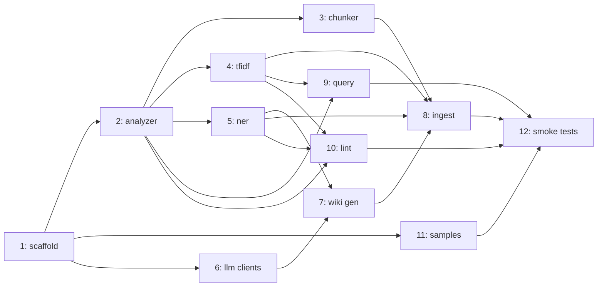

# 日本語 RAG 向けチャンク化 + TF-IDF + 固有名詞 Wiki スクリプト

## Overview

日本語文書を RAG 用コーパスに変換する Python CLI を実装する。Ginza (`ja_ginza_electra` + OntoNotes5 NER via `token._.ne`) による文境界チャンク化、scikit-learn による TF-IDF 疎ベクトル + 上位キーワード生成、固有名詞に対する LLM 要約 wiki の自動生成を一体で扱う。

`ingest` / `query` / `lint` の 3 サブコマンドで操作し、LLM バックエンドは Anthropic (本命) + Ollama (コストゼロ検証) + OpenAI (インターフェース準拠のプレースホルダ) のプラガブル設計。

## Problem Frame

origin doc (`docs/brainstorms/2026-04-21-japanese-rag-chunking-requirements.md`) の「Problem Frame」を参照。要点:
- 従来のチャンク化スクリプトは健全性チェックが後回しで、固有名詞レベルの「何が書かれているか」が失われる
- Karpathy "LLM Wiki" の操作モデル (ingest/query/lint) を採用し、LLM 要約は固有名詞にスコープ限定
- 出力は 2 系統: (a) `chunks.jsonl` + `vocab.npz` + `analyzer.json` (RAG 検索器の入力)、(b) `entities/*.md` + `index.md` (一級出力、下流消費者契約として維持)

## Requirements Trace

origin doc の R1〜R26 + R8b + R18b をすべてカバーする。単一 Unit が所有する原則で重複割当を避ける (正規化定義のような共有契約は「定義は Unit X、実装/呼び出しは Unit Y」と明記):

- **R1** (Ginza + analyzer.json モデル情報記録) → Unit 2
- **R2, R3, R4** (chunking + overlap) → Unit 3
- **R5, R6, R7, R8** (TF-IDF + analyzer.json への前処理設定書き出し) → Unit 4 (R5/R6/R8 の永続化), Unit 2 (R7 の前処理定義)
- **R8b** (破壊的全再生成) → Unit 8
- **R9** (ingest CLI + エッジケース + --skip-wiki + identity バナー) → Unit 8
- **R10** (query CLI) → Unit 9
- **R11, R12** (lint + exit codes) → Unit 10
- **R13** (NER 抽出 + チャンクメタデータ) → Unit 5
- **R14** (しきい値適用) → Unit 5
- **R15** (wiki frontmatter/本文構造 + ファイル名) → Unit 7
- **R16** (index.md 生成) → Unit 8 (manifest.json を読むだけなので ingest orchestration に置く)
- **R17** (log.md: 実行情報は Unit 8 が集約、トークン数は Unit 7 が `WikiStats` で返して Unit 8 が書き込む) → Unit 8 (writer) + Unit 7 (stats provider)
- **R18, R18b** (source_hash / 増分 / 失敗リトライ) → Unit 7
- **R19, R20, R21** (LLMClient / バックエンド) → Unit 6
- **R22** (失敗ハンドリング: pre-flight / retry / budget / systemic failure) → Unit 7
- **R23, R24, R25** (サンプル本体 + 受入基準) → Unit 11
- **R26** (スモークテスト) → Unit 12
- **Success Criteria 全項目** → Unit 12 (integration tests)

**共有契約**: Unit 2 の `normalize_text` 定義と `AnalyzerConfig.normalization` は、R18 の `source_hash` 計算で同一適用される (Unit 7 が Unit 2 の関数を呼ぶ)。要件所有は Unit 2 / Unit 7 / Unit 4 の間で重複しないが、依存関係として繋がる。

## Scope Boundaries

origin doc の Scope Boundaries を継承。非対象項目を再掲:

- 埋め込みモデル (dense vector) 生成
- BM25 スコアリング
- 増分 ingest (常に破壊的全再生成)
- ベクトル DB / ScalarDB 書き込み (将来、`chunks.jsonl` スキーマは安定契約)
- HTML / PDF / Office 直接読み込み
- wiki ページ間の自動的な意味統合 (表記ゆれ統合)
- Web UI / サーバ
- マルチ言語対応
- wiki の RAG パイプラインからの自動消費機構 (v2)
- 読みがな ベースのエンティティ表記近似検出 (文字列 Levenshtein のみ)
- 独立 `generate-wiki` サブコマンド (`--skip-wiki` のオプトアウトのみ)

### Deferred to Separate Tasks

- `query` entity フィルタ (「X が言及されたチャンクから top-K」): v2 機能として分離
- ScalarDB への取り込みパイプライン: 後続タスク (別リポジトリで扱う想定)
- wiki の RAG プロンプト自動注入機構: v2

## Context & Research

### Relevant Code and Patterns

- **新規プロジェクト**: `/Users/wfukatsu/work/chunking/` 配下は空。既存コードパターンなし
- 親ワークスペース (`/Users/wfukatsu/work/CLAUDE.md`) の規約: 日本語でユーザ向けドキュメント、Python 識別子は英語
- Ginza README (megagonlabs/ginza): `ja_ginza_electra` の `ent.label_` / `token.ent_type_` は拡張固有表現 (Person, Company 等) を返し、OntoNotes5 ラベルは `token._.ne` セカンダリ属性経由 — origin doc 作成時に確認済み

### Institutional Learnings

- `docs/solutions/` は存在しない (新規プロジェクトのため)

### External References

- Ginza: https://github.com/megagonlabs/ginza (ja_ginza_electra のラベル体系確認済み)
- scikit-learn TfidfVectorizer: `custom analyzer` でトークナイザを注入する公式パターンを採用
- scipy.sparse: `save_npz` / `load_npz` で TF-IDF 疎行列の標準永続化
- Anthropic Python SDK (`anthropic`): `messages.create` で同期呼び出し、`input_tokens` / `output_tokens` を response から取得
- Ollama Python SDK (`ollama`): `ollama.generate(model=..., prompt=...)` で疎通。`ollama.show` でモデル manifest の SHA を取得

## Key Technical Decisions

- **TF-IDF 成果物の永続化**: 1 つの `vocab.npz` (`np.savez_compressed` で単一 `.npz` に複数配列) に `matrix_data / matrix_indices / matrix_indptr / matrix_shape / vocabulary_terms / idf / config` をまとめて格納する (`scipy.sparse.save_npz` 単独ではスパース行列しか保存できないため、語彙+IDF+vectorizer 設定も同一 `.npz` に入れる)。`query` 側は fitted vectorizer を pickle 復元せず、`vocabulary_terms + idf + config` から新しい `TfidfVectorizer` を再構成して現在の `JapaneseAnalyzer.tokenize_for_tfidf` を callable 注入する。
- **`chunks.jsonl` の `sparse_vec`**: **インラインは採用しない**（Key Technical Decisions と schema の矛盾を解消）。各チャンクには `row_index` (0-based、vocab.npz の matrix row と対応) のみを格納。cross-ingest の安定性は `chunk_id` で担保し、`row_index` は単一 `output_dir` 内のみ有効。
- **`source_hash` と前回成否の保存先**: `entities/manifest.json` を主(正)、個別 wiki の frontmatter にも同値を冗長記録。`--retry-failed` が全 `.md` スキャンを避けられるため *(see origin: [Affects R18])*。
- **LLM 呼び出し順序**: `mention_count DESC → chunk_count DESC → entity_name ASC` の決定論的順序で、`--max-llm-calls` が効いた際に高価値エンティティから消化する (R22)。
- **Ginza NER アクセス経路 (単一方式に commitment)**: `token._.ne` 経由で OntoNotes5 ラベルを取得する。トークンを左から走査し、`B-XXX` で span を開始 → 連続する `I-XXX` を併合 → `O` または別 `B-` で終端、という標準 BIO タグ結合で Span 相当を構築する (`start_char = token.idx`, `end_char = token.idx + len(token)`)。`doc.ents` (デフォルトの拡張固有表現ラベル) は本プロジェクトでは使用しない。Analyzer 初期化時に `token._.ne` が populated であることを確認し、empty なら `AnalyzerNEUnavailableError` を raise。
- **Analyzer 永続化形式の版数整合性**: 「完全一致必須」フィールド (tokenization を決定的に変える) と「互換範囲で OK」フィールドを区別する:
  - **完全一致**: `model_name`, `model_checksum`, `split_mode`, `pos_allowlist`, `stopwords`, `lemma_rules`, `normalization.*`, `sudachidict` binary SHA-256 (パッケージバージョンではなく `system.dic` の実バイナリ sha256)
  - **互換範囲 (major.minor 一致、patch は warn のみ)**: `ginza`, `spacy`, `sudachipy`, `sudachidict` パッケージバージョン
  - Sudachi dict の binary hash は `sudachipy.Dictionary().get_system_dict_version()` が利用可ならそれを、無ければ `sha256(system.dic)` を保存
- **pre-flight プロンプト形状と成功条件**: `src/chunking/resources/preflight_prompt.txt` (パッケージ同梱、`importlib.resources` でロード) に本番プロンプトと同形状の 1 文 + 1 架空エンティティ名を用意。本番と同じ system prompt / max_tokens で 1 回呼び出す。**成功条件**: `len(result.text.strip()) > 0 and result.output_tokens > 0 and finish_reason in {"end_turn", "stop"}`。LLM が「知らない」と返答してもこの条件を満たせば OK (API 到達性のみを試験。知識テストではない)。失敗は `LLMPreflightError` (permanent subclass) で即時 abort。タイムアウトは 30 秒。
- **manifest.json の atomic write 実装要件**: `tempfile.NamedTemporaryFile(dir=<entities_dir>, delete=False)` で必ず同一ファイルシステムに tmp を作成 (cross-filesystem の EXDEV 回避)。`f.flush() + os.fsync(f.fileno())` 後 `os.replace(tmp, final)`。POSIX では `os.fsync(os.open(entities_dir, os.O_RDONLY))` で親ディレクトリの dirent も同期。Windows はこの fsync が NotImplementedError なので catch して続行。
- **chunk_id の正規形式**: `posix_relative_source = Path(source).relative_to(input_dir).as_posix()` で OS 非依存のパスに変換し、`key = f"{posix_relative_source}|{char_start}|{char_end}|{sha256(text.encode('utf-8')).hexdigest()}"` を sha256 して先頭 12 桁。フィールド区切りに `|` を挟むことで `"a.txt" + 1 + 23` と `"a.txt1" + 2 + 3` の衝突を防ぐ。
- **Ollama モデル識別子の取得順**: `ollama.show(model)` の返値から `details.digest` → `digest` → `sha256(modelfile_text)` の順でフォールバックし、最後まで取れなければ `{model}@unknown` を記録して warning を出す (ingest は止めない。source_hash が固定になるため増分 cache は効くが、モデル実態が変わっても検知できないリスクあり)。
- **Sample #5 執筆ワークフロー**: Claude で架空歴史人物の百科事典風記事を下書き、作成者が事実整合・実在衝突を人手校正。差分はコミットログで追跡 (R23)。
- **log.md の書き込み戦略**: 逐次 append + `flush() + fsync()`。並列書き込み (複数 ingest プロセスの競合) は非対象。ingest 開始時に run-start エントリを書き、終了時に run-summary エントリを書く (クラッシュ時は run-summary の欠落で中断を検知可能)。
- **Unit 7 のサイズ**: ManifestStore + source_hash 計算 + pre-flight + LLM ループ + retry/backoff + budget + systemic failure 検出 + frontmatter 生成を **1 Unit で扱う** (scope レビューで分割提案あり)。理由: これら 7 機能は全て wiki 生成 1 パスで連携するため、分割すると並列開発しても結合時にインターフェース調整が発生する。ただし内部モジュール分割 (e.g., `wiki/hasher.py`, `wiki/manifest.py`, `wiki/generator.py`) は許容。
- **systemic failure detection を fail-fast 優先にする**: R22 の累積 `failed/(succeeded+failed) > 0.5` しきい値は、transient 障害 (Anthropic の一時的 rate limit、Ollama のモデルロード遅延等) が先頭 3 件に偏ったケースで、回復可能な状況でも abort を引き起こす。それを承知した上で **fail-fast を優先**する。判断理由:
  - budget guard (`--max-llm-calls`) と組み合わせたとき、transient 障害を楽観的に続行するとコストが青天井になるリスクがある
  - abort してもユーザは次回 ingest で自動的に再試行される (R18b の failed retry)
  - rolling window 方式は実装が複雑で、単一開発者ツールのスコープに不相応
  - CI/自動化で使う場面では fail-fast のほうが問題を表面化しやすい
  将来的に本番ワークロードで transient 障害が多発するようなら、rolling-window または `--transient-tolerance N` フラグの追加を planning 再招集で検討。
- **`--retry-failed` と `--force-regenerate` の優先順序**: `--force-regenerate` が最優先 (全エンティティ無条件再生成、前回状態無視)。`--retry-failed` は前回 `failed` と `budget_skipped` を再試行対象に含めるが、前回 `success` でかつ source_hash が不変のエンティティはスキップ。両方指定時は `--force-regenerate` が勝ち、`--retry-failed` は no-op (警告ログ)。
- **`samples/expected.yaml` の照合方式**: 厳密 chunk_id 一致ではなく **substring 照合** (期待テキストが top-K チャンクの `text` フィールドに含まれるか) を採用。チャンク化パラメータの微調整で chunk_id が入れ替わっても fixture を保守可能。
- **Sample #5 (Claude 下書き + 作成者校正) の commit ポリシー**: 問題なし。全サンプル (Claude 下書きを含む) をリポジトリに commit する。校正後のテキストは AI 生成物としてのマーカーを埋め込まない (通常の samples と同様に扱う)。

## Open Questions

### Resolved During Planning

- TF-IDF 疎ベクトル永続化形式 → `np.savez_compressed` 単一 `.npz` に matrix+vocab+idf+config 全部格納
- source_hash 物理保存先 → `entities/manifest.json` 主 + frontmatter 冗長記録
- Sample #5 執筆フロー → Claude 下書き + 作成者校正 + 通常どおり commit (社内規定問題なし)
- log.md 並列書き込み → v1 は単一開発者想定で非対象
- Pre-flight プロンプト形状 → `src/chunking/resources/preflight_prompt.txt` 同梱、本番プロンプト同形状、成功判定明記
- `--retry-failed` と `--force-regenerate` の優先順序 → force が最優先、retry は前回 failed/budget_skipped を対象に追加
- systemic failure の fail-fast vs rolling-window → fail-fast で決定 (理由は Key Decisions 参照)
- `samples/expected.yaml` の照合方式 → substring 照合
- lint 重複・表記近似検出のスケール制限 → `lint_pairwise_threshold=2000` 超でスキップ

### Deferred to Implementation

- Ollama での日本語要約品質: Sample #5 を書き終えた後、`qwen2.5:7b-instruct` / `gemma2` / `phi4` 等で実測して最終モデルを決める。計画時点では `qwen2.5:7b-instruct-q4_K_M` を仮デフォルトとしておく。
- Ginza NER の技術固有名詞カバレッジ: Sample #2 (技術ドキュメント) を書いた後、PRODUCT/ORG で期待エンティティが拾えるかを計測。拾えない場合は Unit 5 に「ユーザー辞書注入」or「TF-IDF 上位語補助」サブタスクを追加する。
- TF-IDF 縮退しきい値 (`L2 < 1e-6 or nnz < 3`): サンプルで実測後に lint デフォルトを微調整。
- デフォルトモデル名 (`claude-haiku-4-5`) の実装時点での疎通確認: SDK でエラーが出たら最新公開 snapshot に差し替え。
- **本番スケール化時の lint 重複・表記近似アルゴリズム**: `sklearn.neighbors.NearestNeighbors(metric='cosine')` or MinHash LSH への切替。v1 では pairwise。実施時期は本番コーパス運用が具体化した時点。

## Output Structure

```
chunking/
├── pyproject.toml
├── README.md
├── docs/
│   ├── brainstorms/2026-04-21-japanese-rag-chunking-requirements.md   (既存)
│   └── plans/2026-04-21-001-feat-japanese-rag-chunking-plan.md        (本ファイル)
├── src/
│   └── chunking/
│       ├── __init__.py
│       ├── cli.py                    # argparse エントリポイント
│       ├── analyzer.py               # Ginza/Sudachi ラッパ + analyzer.json I/O + 正規化
│       ├── chunker.py                # 文境界チャンク + オーバーラップ
│       ├── tfidf.py                  # TfidfVectorizer + vocab.npz I/O
│       ├── ner.py                    # NER 抽出 + エンティティ集約 + しきい値フィルタ
│       ├── schema.py                 # dataclass: ChunkRecord / EntityRecord / LogEntry 等
│       ├── normalize.py              # NFKC + LF + trim + collapse
│       ├── llm/
│       │   ├── __init__.py           # LLMClient Protocol + GenerateResult + errors
│       │   ├── anthropic_client.py
│       │   ├── ollama_client.py
│       │   └── openai_client.py      # placeholder (NotImplementedError on generate)
│       ├── wiki.py                   # entity wiki 生成 + source_hash + manifest + retry/budget
│       ├── ingest.py                 # ingest オーケストレーション
│       ├── query.py                  # query 実装
│       └── lint.py                   # lint 検査ロジック
├── samples/
│   ├── 01_news.txt                   # ~5,000 字 ビジネスニュース
│   ├── 02_tech.txt                   # ~6,000 字 技術ドキュメント
│   ├── 03_interview.txt              # ~5,000 字 対談
│   ├── 04_travel.txt                 # ~5,000 字 旅行エッセイ
│   ├── 05_biography.txt              # ~4,500 字 架空人物百科事典
│   ├── 06_fiction.txt                # ~4,500 字 小説抜粋
│   └── expected.yaml                 # スモークテスト期待結果
└── tests/
    ├── __init__.py
    ├── conftest.py
    ├── fixtures/
    │   └── preflight_prompt.txt
    ├── test_normalize.py
    ├── test_analyzer.py
    ├── test_chunker.py
    ├── test_tfidf.py
    ├── test_ner.py
    ├── test_llm_clients.py
    ├── test_wiki.py
    └── test_ingest_query_lint_smoke.py
```

## High-Level Technical Design

> *以下は実装方針を伝えるための directional guidance であり、実装仕様書ではない。実装エージェントはコンテキストとして扱い、コードとしてコピーしない。*

### 主要データフロー (ingest)

```mermaid
flowchart TD
    A[samples/*.txt] --> B[normalize: NFKC+LF+trim+collapse]
    B --> C[analyzer: Ginza sentence split + POS + NER]
    C --> D[chunker: 500字目標 + 100字overlap]
    D --> E[chunks.jsonl素案]
    C --> F[ner: token._.ne 集約]
    E --> G[tfidf.fit + transform]
    G --> H[vocab.npz保存]
    G --> I[chunks.jsonl最終 (sparse+top_keywords付与)]
    F --> J[min_mentions/min_chunks フィルタ]
    J --> K{wiki 対象?}
    K -->|yes| L[source_hash 計算]
    L --> M{manifest.json で前回一致?}
    M -->|yes & 前回成功| N[スキップ]
    M -->|no or failed| O[pre-flight probe]
    O --> P[優先順序ソート<br/>mention_count DESC]
    P --> Q[LLM summarize ループ<br/>budget/failure guards]
    Q --> R[entities/LABEL__name.md + manifest.json]
    R --> S[index.md 生成]
    I --> T[log.md 追記]
    H --> T
    R --> T
```

### chunks.jsonl スキーマ (1 行 = 1 チャンク)

```json
{
  "chunk_id": "string (sha256 prefix 12桁、R8b 破壊再生成でも同一入力なら同一)",
  "row_index": 0,
  "source": "POSIX relative path from input_dir",
  "char_start": 0,
  "char_end": 500,
  "text": "チャンク本文 (正規化済み、NFKC+LF+trim+collapse 適用済み)",
  "top_keywords": [{"term": "...", "tfidf": 0.5}],
  "entities": [{"name": "...", "ner_label": "PERSON", "char_start": 0, "char_end": 3}]
}
```

注意:
- `sparse_vec` はインラインで持たない。TF-IDF 疎ベクトルは `vocab.npz` の `matrix_*` 配列と `row_index` で参照する。
- `char_start/char_end` は**正規化後テキスト**の char オフセット (source ファイルの元テキストではない)。元テキストとの往復は不可。

### entities/manifest.json スキーマ

```json
{
  "version": 1,
  "generated_at": "2026-04-21T10:00:00Z",
  "ginza_model": "ja_ginza_electra@<checksum>",
  "llm_model": "claude-haiku-4-5",
  "prompt_template_version": "v1",
  "entries": {
    "PERSON__tanaka_taro": {
      "entity_name": "田中太郎",
      "ner_label": "PERSON",
      "source_hash": "sha256:...",
      "status": "success | failed | budget_skipped",
      "last_attempt_at": "2026-04-21T10:00:05Z",
      "mention_count": 5,
      "chunk_count": 3,
      "chunk_ids": ["c001", "c003", "c007"],
      "cooccurring_entities": [{"name": "...", "ner_label": "ORG"}]
    }
  }
}
```

### analyzer.json スキーマ

```json
{
  "version": 1,
  "strict_match": {
    "model_name": "ja_ginza_electra",
    "model_checksum": "sha256:...",
    "split_mode": "C",
    "pos_allowlist": ["NOUN", "VERB", "ADJ", "PROPN"],
    "stopwords": ["こと", "もの", ...],
    "lemma_rules": "lemma_ field as-is",
    "sudachidict_binary_sha256": "sha256:...",
    "normalization": {
      "nfkc": true,
      "lf_only": true,
      "strip_trailing": true,
      "collapse_spaces": true
    }
  },
  "compat_match": {
    "ginza": "5.2.0",
    "spacy": "3.7.4",
    "sudachipy": "0.6.8",
    "sudachidict_package": "sudachidict_core",
    "sudachidict_package_version": "20250101.post1"
  },
  "tfidf": {
    "min_df": 1,
    "max_df": 0.95
  }
}
```

load 時の検証ポリシー:
- `strict_match.*` が 1 つでも異なれば `AnalyzerVersionMismatchError` を raise して非ゼロ終了
- `compat_match.*` は major.minor 一致で OK、patch 相違は warning のみ

## Implementation Units

### 依存関係サマリ



---

- [ ] **Unit 1: Project scaffolding**

**Goal:** Python パッケージ骨格と依存・CLI エントリポイント骨格・README (identity バナー付き) を作る。後続の全 Unit の土台。

**Requirements:** (基盤、直接の R マッピングなし。R9/R10/R11 の CLI 構造の前提)

**Dependencies:** なし

**Files:**
- Create: `pyproject.toml`
- Create: `README.md`
- Create: `src/chunking/__init__.py`
- Create: `src/chunking/cli.py`
- Create: `tests/__init__.py`
- Create: `tests/conftest.py`

**Approach:**
- `pyproject.toml` に Python 3.11+, dependencies: `spacy>=3.7,<4`, `ginza>=5.2`, `sudachipy>=0.6`, `sudachidict_core`, `scikit-learn>=1.4`, `scipy>=1.11`, `numpy`, `anthropic`, `ollama`, `pyyaml`, `pytest`。
  - `ja_ginza_electra` は PyPI に正規ホストされていないため、直接 URL 依存で書く: `ja-ginza-electra @ https://github.com/megagonlabs/ginza/releases/download/v5.2.0/ja_ginza_electra-5.2.0-py3-none-any.whl` (最新 URL は実装時に Ginza リリースページで確認)。
  - OpenAI SDK は入れない (placeholder 実装のため)
- `README.md` に install 手順を明記: (1) `pip install -e .` (ja_ginza_electra は URL 依存で同時にダウンロード)、(2) `python -m spacy validate` で確認
- `cli.py` に `argparse` で `ingest` / `query` / `lint` のサブコマンドディスパッチを切る (実装本体は各 Unit で埋める)
- `README.md` に identity バナー「本スクリプトは RAG コーパスの前処理・健全性・一級エンティティ知識ベース生成ツール。本番検索は下流 vector store で行う前提」を冒頭に
- README に「既知の限界」セクションも作成: TF-IDF 単独の言い換えクエリに対する弱さを事前に明記 (Success Criteria の R22 remediation path の文書化義務を果たす)
- エントリポイント `chunking = "chunking.cli:main"` を `pyproject.toml` の `[project.scripts]` に登録
- CLI は `--help` 出力にも identity バナーを1行入れる (R9 の要件)

**Patterns to follow:**
- 一般的な `src/` レイアウト (setuptools)

**Test scenarios:**
- Happy path: `pytest --collect-only` でテスト収集が成功する
- Happy path: `python -m chunking --help` に identity バナーが表示される

**Verification:**
- `pip install -e .` が成功する
- `chunking --help` で 3 サブコマンドが表示される

---

- [ ] **Unit 2: Analyzer module (Ginza + Sudachi + normalization + analyzer.json I/O)**

**Goal:** 日本語テキストの文境界分割・POS/NER 抽出・トークン正規化・テキスト正規化 (NFKC+LF+trim+collapse) を一括で提供する。設定を `analyzer.json` にシリアライズ / 復元する。後続 Unit の共通依存。

**Requirements:** R1, R7 (分かち書きの前処理定義。R7 の `analyzer.json` 書き出しは Unit 4 と協調)

**Dependencies:** Unit 1

**Files:**
- Create: `src/chunking/analyzer.py`
- Create: `src/chunking/normalize.py`
- Create: `src/chunking/schema.py` (AnalyzerConfig dataclass 等)
- Create: `tests/test_analyzer.py`
- Create: `tests/test_normalize.py`

**Approach:**
- `normalize.py` に `normalize_text(s: str) -> str` を実装。NFKC + 改行 LF 統一 + 末尾空白除去 + 連続空白折りたたみ。Idempotent
- `analyzer.py` にクラス `JapaneseAnalyzer`: `__init__(config: AnalyzerConfig)` で `spacy.load("ja_ginza_electra")` + Sudachi config を適用
- メソッド: `iter_sentences(text)`, `iter_entities(text)` (`token._.ne` 経由で OntoNotes5 ラベル)、`tokenize_for_tfidf(text) -> list[str]` (POS フィルタ + lemma)
- `save(path)` で `analyzer.json` 書き出し、`load(path)` で復元 + 現在のランタイムと厳密一致チェック (不一致は例外)
- Ginza モデルチェックサムは spaCy の `meta.json` から取得

**Patterns to follow:**
- spaCy の custom pipeline extension 登録パターン (`Doc.set_extension` / `Token.get_extension`)

**Test scenarios:**
- Happy path: 日本語サンプル 1 段落を入力、期待される文数で分割される
- Happy path: `normalize_text("Ｃａｆｅ　\r\n  \r\n テスト ")` が `"Cafe\nテスト"` (NFKC + CRLF→LF + trim + 空白折りたたみ)
- Happy path: `normalize_text(normalize_text(x)) == normalize_text(x)` (idempotent)
- Happy path: `token._.ne` で `PERSON` / `ORG` / `LOC` / `PRODUCT` ラベルが取れる (サンプル文で検証)
- Happy path: `tokenize_for_tfidf("東京に行きました。")` が `["東京", "行く"]` 相当 (助詞・助動詞除去、lemma 化)
- Edge case: 空文字列入力で空リスト / `iter_sentences("")` が空イテレータ
- Edge case: BOM 付き UTF-8 を正規化で剥がす
- Integration: `save("analyzer.json")` → 別プロセスで `load("analyzer.json")` → 同じトークナイズ結果を返す
- Error path: `load` 時に `ginza` 版数が保存時と不一致なら `AnalyzerVersionMismatchError` で例外

**Verification:**
- 全テスト green
- `JapaneseAnalyzer` が各 Unit からインポート可能

---

- [ ] **Unit 3: Chunker**

**Goal:** 文境界尊重の char-target チャンキング + オーバーラップ + 巨大文のソフト分割フォールバック。

**Requirements:** R2, R3, R4, R8b (破壊的再生成の前提)

**Dependencies:** Unit 2

**Files:**
- Create: `src/chunking/chunker.py`
- Create: `tests/test_chunker.py`

**Approach:**
- `Chunker(analyzer, target_chars=500, overlap_chars=100, max_chunk_chars=1500)` クラス
- **入力契約**: Chunker は **正規化済みテキスト** (normalize_text 適用後) を入力とする。正規化は呼び出し側 (Unit 8 ingest) が 1 回だけ行い、chunker と analyzer はその結果を共有する。char_start/char_end オフセットは**正規化後テキスト**での位置であり、元 `.txt` ファイルの char 位置とは一致しないことがある (R1 の `analyzer.json` 強制整合で再現性は担保)。
- `chunk_document(source_relative_path, normalized_text) -> Iterator[ChunkRecord]`:
  1. `analyzer.iter_sentences(normalized_text)` で文リスト取得 (analyzer は入力を再正規化しない前提)
  2. 文を累積してターゲット char 以上になったらチャンク境界
  3. 1 文が `target_chars` を超えたら単独チャンク (警告)
  4. 1 文が `max_chunk_chars` を超えたらソフト分割 (`、`→改行→その他) で `max_chunk_chars` 以下に刻む
  5. オーバーラップ: 直前チャンク末尾から `overlap_chars` 遡った位置を文境界にスナップ (R4 のルール 1-3)
- `chunk_id` 構築 (Key Technical Decisions 参照):
  ```
  posix_source = Path(source).relative_to(input_dir).as_posix()
  text_hash = sha256(text.encode("utf-8")).hexdigest()
  key = f"{posix_source}|{char_start}|{char_end}|{text_hash}"
  chunk_id = sha256(key.encode("utf-8")).hexdigest()[:12]
  ```
  安定性の範囲: **同一の chunking パラメータ** (target_chars, overlap_chars, max_chunk_chars) と同一 source/ 正規化結果で同じ ID を返す。chunking パラメータを変えると全 chunk_id が入れ替わる (R8b の全再生成と整合)。

**Patterns to follow:**
- イテレータベースで memory efficient

**Test scenarios:**
- Happy path: 3000 字のテキストで、中央値 500 字・オーバーラップ ~100 字のチャンク列が生成される
- Happy path: オーバーラップ開始位置が必ず文境界と一致する
- Edge case: 1 文 800 字 (target 超) の入力 → 単独チャンク + 警告ログ
- Edge case: 1 文 2000 字 (max_chunk_chars 超) の入力 → `、` でソフト分割され各チャンク <= max
- Edge case: オーバーラップ窓 [N/2, 2N] に文境界が無いケース → オーバーラップ 0 + log.md 記録
- Edge case: 空文字列入力 → 空リスト
- Edge case: 1 文のみの 100 字入力 → 1 チャンク (オーバーラップなし)
- Integration: `Chunker` が正規化済みテキストを入力とする前提の契約を保つ (正規化は呼び出し側)

**Verification:**
- チャンク長の中央値が `target_chars ± 20%` 範囲に入る
- 全オーバーラップ開始位置が文境界

---

- [ ] **Unit 4: TF-IDF + keyword extraction**

**Goal:** scikit-learn の `TfidfVectorizer` にカスタムアナライザ (Ginza) を注入し、コーパス全体で fit、各チャンクの疎ベクトルを生成、上位 N 語を keywords メタデータに付与。`vocab.npz` で永続化。

**Requirements:** R5, R6, R7, R8

**Dependencies:** Unit 2

**Files:**
- Create: `src/chunking/tfidf.py`
- Create: `tests/test_tfidf.py`

**Approach:**
- `TfidfBuilder(analyzer, top_keywords=10, min_df=1, max_df=0.95)` クラス
- `fit_transform(chunks) -> (sparse_matrix, vocabulary, idf_array)`: `TfidfVectorizer(analyzer=analyzer.tokenize_for_tfidf)` で学習。`vectorizer.vocabulary_` (dict term→idx) と `vectorizer.idf_` を取得
- `top_keywords_per_chunk(matrix, vocab) -> list[list[{term, tfidf}]]`: 各行の argsort で上位 N 語抽出 (行ごとに新しい sparse 行からスライス)
- `save(matrix, vocabulary, idf, config, path="vocab.npz")`: `np.savez_compressed` で以下を単一 `.npz` に格納:
  - `matrix_data`, `matrix_indices`, `matrix_indptr`, `matrix_shape` (CSR 疎行列の内部表現)
  - `vocabulary_terms` (numpy array of strings、idx 順)
  - `idf` (IDF numpy array)
  - `config` (min_df, max_df, norm, sublinear_tf, smooth_idf — JSON 文字列化して保存)
- `load(path) -> (matrix, vocabulary, idf, config)`: 復元
- `rebuild_vectorizer(analyzer, vocabulary, idf, config) -> TfidfVectorizer`: **fitted vectorizer は pickle しない**。復元時は新しい `TfidfVectorizer(**config)` を作り、`vocabulary_` と `idf_` と `_tfidf.idf_` を手動注入。analyzer callable は現在の `JapaneseAnalyzer.tokenize_for_tfidf` を bind
- `transform_query(vectorizer, query_text) -> sparse_vec`: 復元した vectorizer で新規クエリをベクトル化

**Patterns to follow:**
- scikit-learn の `TfidfVectorizer` 標準 API
- scipy.sparse の NPZ シリアライズ

**Test scenarios:**
- Happy path: 10 チャンクのコーパスで `fit_transform` → matrix.shape == (10, vocab_size)
- Happy path: `top_keywords_per_chunk` が tfidf 降順で上位 N 語を返す
- Happy path: `save` → `load` で matrix・vocab が厳密一致
- Happy path: `transform_query` で新規クエリがベクトル化され、既存コーパスとコサイン類似度計算できる
- Edge case: 全チャンクが同じトークンで構成される → IDF がほぼゼロの縮退ベクトルが生成される (lint がキャッチする想定)
- Edge case: 1 チャンクのみのコーパスで fit → min_df=1 で動作する
- Edge case: 語彙にないトークンのみのクエリ → ゼロベクトル返却 (query 側で警告が必要)
- Error path: 空コーパス (0 チャンク) で `fit_transform` → 明示的に ValueError (R9 のエッジケースで拾う)

**Verification:**
- TF-IDF 行列の L2 norm が想定範囲
- `top_keywords` が各チャンクで最大 N 件

---

- [ ] **Unit 5: NER extraction + entity aggregation**

**Goal:** `analyzer.iter_entities` の結果をチャンクごとに保存し、コーパス全体でエンティティを集約、`min_mentions` / `min_chunks` しきい値を適用して wiki 生成対象リストを作る。

**Requirements:** R13, R14

**Dependencies:** Unit 2

**Files:**
- Create: `src/chunking/ner.py`
- Create: `tests/test_ner.py`

**Approach:**
- `extract_entities_per_chunk(analyzer, chunks, target_labels) -> list[list[EntityMention]]`: 各チャンクの正規化済みテキストに対して NER 実行、対象ラベルでフィルタ
- **エンティティ span 構築 (単一方式 commitment)**: `token._.ne` を左から走査し、`B-XXX` で span 開始 → 連続 `I-XXX` を併合 → `O` or 別 `B-` で終端。`start_char = first_token.idx`, `end_char = last_token.idx + len(last_token.text)`, `surface = doc.text[start_char:end_char]`。`doc.ents` は使用しない (Key Technical Decisions 参照)
- `aggregate_entities(entities_per_chunk, min_mentions=3, min_chunks=2) -> list[EntityAggregate]`: 全チャンク横断でエンティティ名+ラベル単位で集約、`mention_count` / `chunk_count` / `chunk_ids` を持たせる。しきい値未満のものはスキップ (ただし `lint` の「wiki 未生成率」判定用に総数と除外数は返す)
- **Filename sanitization (cross-platform)**: NFKC 済みの `entity_name` に対し、
  1. `re.sub(r'[/\\:\*\?"<>\|\s]', '_', name)` で全 OS のパス不正文字を置換
  2. Windows 予約名 (`CON`, `PRN`, `NUL`, `AUX`, `COM1-9`, `LPT1-9`) は末尾 `_` を付与
  3. UTF-8 バイト長が 128 を超える場合は 128 バイト目で切り、末尾に `_<sha256[:6]>` を付けて一意化
  4. 最終形式: `{ner_label}__{sanitized_name}.md` (例: `PERSON__田中太郎.md`, `ORG__株式会社_A_B_<hash>.md`)
- macOS APFS は NFD 正規化でファイル名を保存するが、Python から NFC で開けば透過的に読めるため実害なし (オフセット計算ではなくファイル I/O のみに影響)

**Patterns to follow:**
- spaCy の `doc.ents` イテレーションパターン

**Test scenarios:**
- Happy path: サンプル #1 相当のテキストで PERSON/ORG が期待数抽出される
- Happy path: `min_mentions=3` で 2 回しか出ないエンティティが除外される
- Happy path: `min_chunks=2` で 1 チャンクに 3 回出るだけのエンティティが除外される
- Edge case: 空エンティティ (全チャンク NER ヒット 0) → 空リスト、除外数 0
- Edge case: 同名異ラベル (`PERSON 富士` と `LOC 富士`) → 別エンティティとして扱われる (ファイル名も衝突しない)
- Integration: Unit 3 の ChunkRecord と連携して `entities` フィールドが正しく設定される
- Deferred-to-impl: Sample #2 を書いた後、技術固有名詞 (API 名・OSS 名) の検出率を計測する

**Verification:**
- 全テスト green
- しきい値適用後の集約結果が期待通り

---

- [ ] **Unit 6: LLM client interface + Anthropic + Ollama + OpenAI placeholder**

**Goal:** `LLMClient` プロトコルを定義し、Anthropic / Ollama の 2 実装を同梱。OpenAI は `NotImplementedError` を投げるプレースホルダ。エラー分類 (retryable / permanent) + `GenerateResult` (テキスト + トークン数 + モデル識別子)。

**Requirements:** R19, R20, R21

**Dependencies:** Unit 1

**Files:**
- Create: `src/chunking/llm/__init__.py` (Protocol + GenerateResult + errors)
- Create: `src/chunking/llm/anthropic_client.py`
- Create: `src/chunking/llm/ollama_client.py`
- Create: `src/chunking/llm/openai_client.py`
- Create: `tests/test_llm_clients.py`

**Approach:**
- `LLMClient` Protocol: `generate(prompt: str, max_tokens: int) -> GenerateResult`
- `GenerateResult` dataclass: `text, input_tokens, output_tokens, model_id, finish_reason`
- 例外階層: `LLMError(Exception)` → `LLMRetryableError` / `LLMPermanentError`
- Anthropic 実装: `anthropic.Anthropic()` クライアント、`messages.create` 呼び出し、`usage.input_tokens/output_tokens` 取得、`rate_limit_error` / `timeout` / `APIConnectionError` → retryable、`authentication_error` / `permission_error` → permanent
- Ollama 実装: `ollama.generate(model, prompt, options={"num_predict": max_tokens})`、`model_id` は**ingest 1 回につき 1 回** `ollama.show(model)` を呼んで取得 (プロセス開始時または wiki generator 初期化時に 1 回)。プロセスをまたいではキャッシュしない。返値から `details.digest` → `digest` → `sha256(modelfile_text)` の順でフォールバック。それでも取れなければ `{model}@unknown` を記録して warning
- OpenAI 実装: **コンストラクタで即 `LLMPermanentError("OpenAI backend is a v2 feature — use --llm-backend anthropic or ollama")` を raise**。factory が CLI 起動直後に呼ばれ、ingest のチャンク化等に工数を払う前に fail-fast する (R22 pre-flight の思想と一致)
- factory: `get_client(backend_name: str, config: dict) -> LLMClient`

**Patterns to follow:**
- Python `typing.Protocol` パターン
- `anthropic` SDK の同期 `messages.create` 呼び出し

**Test scenarios:**
- Happy path (mock): Anthropic クライアントが mock された SDK で `generate` を呼ぶと `GenerateResult` が返る
- Happy path (mock): Ollama クライアントが mock された SDK で `generate` を呼ぶ
- Happy path: `get_client("openai", {})` はインスタンス化できる (but `generate` は NotImplementedError)
- Error path (mock): Anthropic の rate_limit_error → `LLMRetryableError` に変換
- Error path (mock): Anthropic の authentication_error → `LLMPermanentError`
- Error path: OpenAI の `generate` 呼び出しで `NotImplementedError`
- Edge case: Ollama の model tag 取得が manifest 未発見 → わかりやすいエラーメッセージ
- Integration (要 API キー、skip-unless-env): `ANTHROPIC_API_KEY` があれば実 API に pre-flight 相当の 1 呼び出しで 200 応答を確認 (CI では skip)

**Verification:**
- mock ベースのテストが全 green
- factory が 3 バックエンド名で動く (openai は generate 時エラー)

---

- [ ] **Unit 7: Entity wiki generator**

**Goal:** Unit 5 の集約結果を入力に、しきい値を満たすエンティティに対して LLM 要約を生成、frontmatter + 本文 + manifest.json を書き出す。`source_hash` による増分キャッシュ、pre-flight probe、budget guard、systemic failure detection、retry/retry-failed を実装。

**Requirements:** R15, R18, R18b, R22 (pre-flight / retry / budget / systemic failure)。R17 のトークン合計は `WikiStats` return で提供する (log.md 書き込み本体は Unit 8)。R16 (index.md) は Unit 8 に完全委譲。

**Dependencies:** Unit 5, Unit 6, Unit 2 (normalize_text を source_hash で共有)

**Files:**
- Create: `src/chunking/wiki.py` (内部モジュール: `wiki/hasher.py`, `wiki/manifest.py`, `wiki/generator.py` への分割を実装時に判断)
- Create: `src/chunking/resources/preflight_prompt.txt` (`importlib.resources` でパッケージ同梱ロード — tests/fixtures/ ではなく src 配下)
- Create: `tests/test_wiki.py`

**Approach:**
- `compute_source_hash(entity_name, ner_label, chunks, analyzer_json_hash, ginza_model_version, llm_model_id, prompt_template_version) -> str`: SHA-256 の合成キー。入力 chunks は `(chunk_id, normalize_text(text))` のタプル配列を `sorted(key=chunk_id)` で正規順序化してから連結 (R18 の正規化定義を再利用)。`analyzer_json_hash` は canonical JSON (`json.dumps(obj, sort_keys=True, ensure_ascii=False)`) の sha256
- `ManifestStore(path)`: `entities/manifest.json` の atomic read/write。書き込み手順:
  1. `tempfile.NamedTemporaryFile(dir=path.parent, delete=False)` で**同一 fs** に tmp 作成
  2. 内容 write → `f.flush()` → `os.fsync(f.fileno())`
  3. `os.replace(tmp_path, path)`
  4. POSIX では親ディレクトリ fd に `os.fsync` (Windows は NotImplementedError を catch)
  読み込み時に JSON パースエラー → warning を出して空 manifest で続行 (破損検知+fail-safe)
- `WikiGenerator(llm_client, manifest_store, prompt_template, budget=None, skip_wiki=False)`:
  - `generate_all(entities, analyzer_config, chunks) -> WikiStats`:
    1. `--skip-wiki` なら pre-flight スキップ + 全エンティティ no-op、空 manifest 保存
    2. `entities` が空 → pre-flight もスキップして no-op 早期 return
    3. pre-flight: `importlib.resources.files("chunking.resources") / "preflight_prompt.txt"` を読み、`llm_client.generate` で 1 回試行。成功条件: `len(result.text.strip()) > 0 and result.output_tokens > 0 and finish_reason in {"end_turn", "stop"}`。タイムアウト 30 秒。失敗は `LLMPreflightError` で即 raise (ingest 全体を非ゼロ終了させる)
    4. 前回 manifest を読み込み、各エンティティの source_hash を計算、status 判定 (success で一致ならスキップ、failed なら retry キューへ)
    5. 対象エンティティを `(mention_count DESC, chunk_count DESC, entity_name ASC)` でソート。前回 failed の再試行と新規は同じキューに合流 (R22 優先順序)
    6. ループ: budget 残あれば LLM 呼び出し、failure なら指数 backoff x3。3 回失敗でスキップ記録
    7. systemic failure 検出: 試行完了 5 件以上かつ `failed/(succeeded+failed) > 0.5` で abort (累積判定、rolling window ではない — fail-fast を優先する decision)
    8. 成功したものは frontmatter + 本文 + manifest を書き出し。manifest は途中でも定期的に (e.g., 5 エンティティごとに) checkpoint 書き込み、SIGKILL 時のデータロスを抑制
    9. budget 超過したものは `budget_skipped` 記録 (R18b の自動再試行対象外、`--retry-failed` で明示再試行)
- **Frontmatter の書き込み契約 (YAML 安全性)**:
  - LLM 生成テキストは**本文のみ**に置き、frontmatter には入れない
  - frontmatter は deterministic フィールド (`entity_name`, `ner_label`, `status`, タイムスタンプ, `source_hash`, `ginza_model`, `llm_model`, `mention_count`, `chunk_count`, `chunk_ids`, `cooccurring_entities`, `ai_verification_status`) のみ
  - 書き込み時は `yaml.safe_dump(frontmatter, default_flow_style=False, allow_unicode=True, default_style="|")` 等で文字列の quote を徹底
  - LLM 本文に `---` / `\n---\n` が含まれても frontmatter を破壊しないよう、本文の前後に独自マーカー (例: `<!-- summary-begin -->`) を置いて切り分ける
- `index.md` 生成は Unit 8 に完全委譲 (Unit 7 は manifest.json を提供するのみ)
- Prompt template は Python 文字列 `PROMPT_TEMPLATE_V1` で定義、変更時は `PROMPT_TEMPLATE_VERSION` 定数も上げる

**Patterns to follow:**
- atomic file write via `tempfile.NamedTemporaryFile` + `os.replace`
- exponential backoff: `time.sleep(2**attempt + jitter)`

**Test scenarios:**
- Happy path (mock LLM): 5 エンティティを入力、全て success、manifest と `.md` ファイルが書かれる
- Happy path: 2 回目の generate_all で source_hash 一致のエンティティはスキップされる (呼び出し回数 0)
- Happy path: pre-flight 成功後に本番呼び出しへ進む
- Edge case: `--skip-wiki` で pre-flight が呼ばれず、0 wiki 生成
- Edge case: budget=3 で 5 エンティティ入力 → 上位 3 件のみ成功、残り 2 件が `budget_skipped`
- Error path (mock): pre-flight 失敗 → 例外で即 terminate、manifest に何も書かれない
- Error path (mock): 10 エンティティ中 7 件が per-call retry 3 回全失敗 → systemic failure で abort (5 件到達時点で >50% 判定)
- Error path: 最初 3 件失敗 + その後 6 件成功 → 5 件到達時点 (3 fail + 2 success) で 60% failure → abort。ただし最小 5 件超えるまでは abort しない
- Integration: `--retry-failed` で前回 failed のエンティティが source_hash 一致でも再試行される
- Edge case: 前回 `budget_skipped` のエンティティは `--retry-failed` なしでは再試行されない (R22 の挙動)
- Edge case: 同名異ラベルのエンティティが同一 manifest に別 entry で格納される
- Edge case: Ollama モデル tag が途中で変わる → source_hash 変化 → 強制再生成される

**Verification:**
- mock を使った全テスト green
- manifest.json とファイルが atomic に書かれる (途中中断で破損しない)

---

- [ ] **Unit 8: Ingest CLI**

**Goal:** `ingest` サブコマンドの本体。入力読み込み・エッジケース処理・analyzer.load-or-init・chunker → tfidf → ner → wiki の orchestration・log.md / index.md 生成。

**Requirements:** R9 (ingest CLI + edge cases + --skip-wiki + バナー), R16 (index.md 生成), R17 (log.md 全体の集約と書き込み), R8b (破壊的再生成)

**Dependencies:** Unit 3, Unit 4, Unit 5, Unit 7

**Files:**
- Create: `src/chunking/ingest.py`
- Modify: `src/chunking/cli.py` (ingest subcommand wiring)

**Approach:**
- CLI シグネチャ: `ingest <input_dir> <output_dir> [--skip-wiki] [--max-llm-calls N] [--force-regenerate] [--retry-failed] [--llm-backend anthropic|ollama] [--config PATH]`
- **`--force-regenerate` と `--retry-failed` の併用**: `--force-regenerate` が最優先。両方指定時は `--retry-failed` を警告付きで no-op 化する。ユーザに意図しない二重フラグを知らせる
- 実行順序:
  0. **早期 fail-fast**: LLM factory で backend 生成 (OpenAI backend なら即 `LLMPermanentError` で非ゼロ終了)、次に入力ディレクトリ存在確認 (R9 エッジケース)
  1. **ステージングディレクトリ戦略で destructive regen を crash-safe に**: 新出力を `<output_dir>.staging/` に書き、完了後に `<output_dir>` を `.backup` へ rename、`<output_dir>.staging` を `<output_dir>` へ rename、最後に `.backup` を削除。途中で SIGKILL されても `.backup` に前回状態が残る
  2. 入力 `.txt` を glob、UTF-8 で読み込み、エッジケース (R9) を処理
  3. 既存 `<output_dir>/entities/manifest.json` をメモリへロード (破損/不在は空 manifest)
  4. `analyzer.json` を `<output_dir>` から load、無ければ現在のランタイムから生成
  5. 全テキストを `normalize_text` で 1 回だけ正規化 → `chunker` でチャンク化 → メモリ保持 (analyzer は正規化済み文字列を受け取り、再正規化しない)
  6. `TfidfBuilder.fit_transform` → `<staging>/vocab.npz` と chunks.jsonl の `row_index` フィールド
  7. `extract_entities_per_chunk` + `aggregate_entities` → しきい値通過エンティティ
  8. `WikiGenerator.generate_all` → `<staging>/entities/*.md` + `<staging>/entities/manifest.json` (pre-flight → ループ)
  9. `index.md` 生成 (manifest.json を読んで NER ラベル別に五十音ソート)
  10. `log.md` 追記 (run-start/run-summary エントリ、LLM トークン合計、モデル版数、エッジケース記録)
  11. ステージングから本番への atomic swap 実施
- `--skip-wiki` 指定時は staging directory に entities/ と index.md は作成しない (ユーザが実行後に出力を ls しても entities/ が生えず、wiki 未生成を直感的に理解できる)

**Patterns to follow:**
- CLI の exit code 規約: 0 = 成功、非 0 = エラー (R12)

**Test scenarios:**
- Happy path: `ingest samples/ out/` で `chunks.jsonl` + `vocab.npz` + `analyzer.json` + `entities/*.md` + `index.md` + `log.md` が全生成
- Happy path: 2 回目の ingest で manifest 一致のエンティティはスキップされる
- Happy path: `--skip-wiki` で `entities/`, `index.md` が作成されず、chunks/tfidf/log は生成される
- Happy path: `--force-regenerate` で manifest を無視して全再生成
- Edge case: 入力 `.txt` が 0 件 → exit code != 0、エラーメッセージ
- Edge case: 入力に空ファイル混在 → スキップ + log.md に記録 + 残りは正常処理
- Edge case: UTF-8 復号失敗のファイル混在 → スキップ + log.md 記録
- Edge case: `output_dir` が既存で manifest が破損 → 警告を出して空 manifest で進行
- Error path: `--llm-backend` 指定不正 → argparse エラー
- Integration: `samples/` を全 ingest → Success Criteria のファイル形状成立

**Verification:**
- `out/` の期待ファイル群がすべて生成される
- `log.md` にトークン合計・モデル版数が記録される

---

- [ ] **Unit 9: Query CLI**

**Goal:** `query` サブコマンドの本体。`analyzer.json` 復元 + vocab.npz ロード + クエリを同一前処理でベクトル化 + コサイン類似度 top-K。

**Requirements:** R10

**Dependencies:** Unit 2, Unit 4

**Files:**
- Create: `src/chunking/query.py`
- Modify: `src/chunking/cli.py` (query subcommand wiring)

**Approach:**
- CLI: `query <output_dir> "<query_text>" [--top-k K]` (default K=5)
- 実行順序:
  1. `output_dir` から `analyzer.json` / `vocab.npz` / `chunks.jsonl` を load
  2. バージョン一致チェック (不一致/不在は exit != 0、メッセージ)
  3. クエリを normalize → `analyzer.tokenize_for_tfidf` → `TfidfBuilder.transform_query`
  4. sparse_matrix @ query_vec.T → 上位 K の chunk_ids
  5. 結果を整形して stdout (chunk_id, source, top_keywords, snippet)
- `--help` に identity バナー (R9 と同じ)

**Patterns to follow:**
- Unit 4 の `transform_query` を呼ぶだけ

**Test scenarios:**
- Happy path: ingest 後の output で `query out/ "テスト"` が 5 件返す
- Happy path: 関連性の高いチャンクが top に来る (サンプル corpus で検証)
- Edge case: 語彙外クエリ → ゼロベクトル警告 + top-K に順序不定の低スコア結果
- Error path: `output_dir` に必要成果物がない → exit != 0、「先に ingest を実行してください」
- Error path: `analyzer.json` バージョン不整合 (ginza 版数が違う) → exit != 0、詳細メッセージ

**Verification:**
- Success Criteria の語彙一致・言い換えクエリを実行できる

---

- [ ] **Unit 10: Lint CLI**

**Goal:** `lint` サブコマンドの本体。R11 の全検査項目を実行、致命/警告/情報で分類、`lint.md` に書き出し、exit code を適切に返す。

**Requirements:** R11, R12

**Dependencies:** Unit 2, Unit 4, Unit 5

**Files:**
- Create: `src/chunking/lint.py`
- Modify: `src/chunking/cli.py` (lint subcommand wiring)

**Approach:**
- CLI: `lint <output_dir>`
- 検査 (R11 に対応):
  - **致命**: `analyzer.json` / `vocab.npz` / `chunks.jsonl` のスキーマ / バージョン不整合、空コーパス
  - **警告**: 空チャンク、1 文のみチャンク、目標の 2 倍超チャンク、`max_chunk_chars` 超過、重複 (コサイン > 0.95)、TF-IDF 縮退 (L2 < 1e-6 or nnz < 3)、孤立 wiki (参照チャンク消失)、wiki 機能失効 (`wikis < 3` かつ `chunks < 20`)
  - **情報**: Levenshtein 比 > 0.85 のエンティティ名ペア
- 出力: stdout に human-readable サマリ + `lint.md` に詳細 (Markdown テーブル)
- exit code: 致命 0 件 → 0、致命 >= 1 → 非 0
- **スケーラビリティ**: 重複検出 (コサイン > 0.95) と表記近似 (Levenshtein) はそれぞれ O(N²) / O(E²) の pairwise 比較 (N = チャンク数、E = エンティティ数)。v1 ターゲット (18,000〜30,000 字、数十チャンク・数十エンティティ) では無視できるコスト。しかし将来的に本番コーパス (10,000 チャンク超) で走らせると遅くなる。**v1 の対応**: 閾値 (`lint_pairwise_threshold`, デフォルト 2000) を超える規模で走らせた場合、重複検出と表記近似をスキップして `lint.md` に「スケール制限でスキップ」を記録する。超えていない場合は従来どおり全ペア比較。将来的な本番運用化時点で `sklearn.neighbors.NearestNeighbors(metric='cosine')` / MinHash LSH 等に切り替えることを Deferred Questions に記載

**Patterns to follow:**
- `scipy.sparse` の row-wise norm 計算
- Python `difflib.SequenceMatcher` for Levenshtein-like ratio (no external dep)

**Test scenarios:**
- Happy path: 健全な corpus に対して致命 0 で exit 0
- Warning path: 空チャンクを含む corpus で警告メッセージ + exit 0
- Warning path: 重複チャンク (2 件) を含む corpus で警告
- Warning path: 60 エンティティの小コーパスで wiki < 3 + chunks < 20 → 警告
- Fatal path: `analyzer.json` を削除した状態で lint → 致命 + exit != 0
- Fatal path: `vocab.npz` のバージョンが違う → 致命
- Info path: `"田中太郎"` と `"田中太郎 "` のペア (Levenshtein 比 > 0.85) → 情報として列挙
- Integration: サンプル corpus で全カテゴリが少なくとも 1 件検出される (意図的に lint ケースを埋め込む)

**Verification:**
- exit code が意図通り
- `lint.md` に全カテゴリのテーブルが出る

---

- [ ] **Unit 11: Sample corpus authoring**

**Goal:** `samples/` 配下に 6 本の日本語テキスト (合計 ~30,000 字)、ジャンル別の固有名詞密度を意図的に変える。R25 の受入基準を満たす。

**Requirements:** R23, R24, R25

**Dependencies:** Unit 1 (samples/ ディレクトリ作成)

**Files:**
- Create: `samples/01_news.txt`
- Create: `samples/02_tech.txt`
- Create: `samples/03_interview.txt`
- Create: `samples/04_travel.txt`
- Create: `samples/05_biography.txt`
- Create: `samples/06_fiction.txt`

**Approach:**
- ジャンル別 char 目標 (origin doc R23 を尊重):
  - 01 news: 5,000 字 (架空会社の合併/決算)
  - 02 tech: 6,000 字 (架空分散 DB 製品チュートリアル、箇条書き・コードブロック含む)
  - 03 interview: 5,000 字 (複数話者、敬称付き)
  - 04 travel: 5,000 字 (架空地名、描写的)
  - 05 biography: 4,500 字 (架空歴史人物、Claude 下書き + 作成者事実校正)
  - 06 fiction: 4,500 字 (独白・会話、エンティティ薄)
- 架空会社 / 人名 / 地名: `カタカナ + 「商事」/「株式会社」` など明らかにフィクショナルな naming
- 受入基準 (R25): 作成者自身が (a) 実在衝突なし (b) 自然な文章 (c) 固有名詞密度がジャンル想定通り — を目視確認
- 執筆方式:
  - 01, 02, 03, 04, 06: 作成者が直接執筆
  - 05: Claude で下書き → 作成者が事実整合・実在衝突を校正

**Patterns to follow:**
- 親ワークスペース規約: 日本語ユーザ向け成果物

**Test scenarios:**
- Test expectation: none — テキストコンテンツそのもの。動作テストは Unit 12 (smoke tests) で
- 受入 (手動): 作成者自身が R25 の 3 基準を目視確認、完了チェック

**Verification:**
- 各ファイルの char 数が R23 の目標 ±10% 以内
- 作成者チェックリスト完了

---

- [ ] **Unit 12: Smoke tests (integration)**

**Goal:** `ingest → query → lint` のエンドツーエンド動作を pytest で自動化。Success Criteria の全項目をカバー (Ollama 互換性は環境依存のため skip-unless-available)。

**Requirements:** R26, Success Criteria 全項目

**Dependencies:** Unit 8, Unit 9, Unit 10, Unit 11

**Files:**
- Create: `samples/expected.yaml`
- Create: `tests/test_ingest_query_lint_smoke.py`

**Execution note:** ネットワーク I/O を避けるため、デフォルトは LLM 呼び出しをモックして `--skip-wiki` 相当で走らせる。`RUN_LLM=1` 環境変数ありの場合のみ実 Anthropic API を叩く (pre-flight 含む)。

**Approach:**
- pytest fixture で `tmp_path / "out"` を作り `ingest samples/ {tmp_path}/out --skip-wiki` を subprocess で実行
- `expected.yaml` に期待結果 (chunk 中央値 char 数範囲、TF-IDF top-5 の関連チャンク substring 期待、lint 致命 0 件、wiki 契約確認)
- テストケース (すべて決定的 pass/fail):
  1. **形状**: `chunks.jsonl` / `vocab.npz` / `analyzer.json` の存在 + 行数 / サイズが妥当範囲
  2. **サンプル char 数**: 各 `samples/0X_*.txt` のファイル長が R23 目標 ±10% 以内 (pytest parametrize で 6 ファイル)
  3. **チャンク長**: 中央値 400-600、最大 800 未満 (R3 例外除く)
  4. **語彙一致クエリ**: `query out "合併の背景"` で news 由来チャンクが top-5 に含まれる (substring 判定) — これは必須アサート
  5. **README 限界事項文書化 (独立アサート)**: `README.md` に「言い換えクエリでは関連チャンクを取りこぼすことがある」に相当する注意書きが存在することをアサート (Unit 1 の作業物に依存、`assert "言い換え" in readme_text or "paraphrase" in readme_text.lower()`)
  6. **言い換えクエリ (モニタリング、skip/fail なし)**: `query out "経営統合の経緯"` の top-10 に news 由来が含まれるかを `tmp_path/paraphrase_report.json` に記録のみ。テストは常に pass。CI の artifact / nightly レポートで傾向追跡
  7. **lint**: `lint out` が致命 0 で exit 0
  8. **wiki 契約 (RUN_LLM=1 時のみ)**: `ingest` 再実行で manifest 一致エンティティがスキップされる (log.md の LLM 呼び出し数が 0)
  9. **backend compat (RUN_OLLAMA=1 時のみ)**: `--llm-backend ollama` で ingest が完走する
  10. **crash-safety (mock)**: ingest 途中で SIGKILL → 次回 ingest が前回状態を参照できる (staging directory 戦略の検証)
- LLM 呼び出しモック: Anthropic SDK を monkeypatch して固定レスポンスを返す。`finish_reason` `"end_turn"`, `output_tokens` 50 固定で pre-flight / 通常呼び出しの両方の成功条件を満たすように

**Patterns to follow:**
- pytest `tmp_path` fixture
- `subprocess.run` でサブコマンド起動

**Test scenarios:**
- Happy path: 通常の samples/ を処理して全項目が満たされる
- Happy path (mock LLM): wiki 生成されるモックでエンティティ .md が manifest と一致
- Environment-gated (`RUN_LLM=1`): 実 Anthropic で pre-flight + 5 エンティティ生成、log.md に記録
- Environment-gated (`RUN_OLLAMA=1`): Ollama で ingest 完走
- Fallback: 言い換えクエリが top-10 に入らない場合、README に remediation 注意書きがあることをアサート

**Verification:**
- `pytest tests/test_ingest_query_lint_smoke.py -v` が green (デフォルト/mock モードで)
- Success Criteria の全必須項目が 1 つ以上のテストでカバーされる

## System-Wide Impact

- **Interaction graph**: `ingest` は analyzer / chunker / tfidf / ner / wiki / llm / manifest store の 7 コンポーネントを跨ぐ orchestration。wiki は manifest を介して状態共有
- **Error propagation**: LLM 一時エラーは retry、permanent はスキップ + log、pre-flight 失敗は即時 abort。chunker/tfidf の ValueError は CLI で catch して exit != 0
- **State lifecycle risks**: manifest の atomic write (tempfile + rename) 必須。ingest 途中中断で manifest 半壊しない設計
- **API surface parity**: `--help` バナー・`query --help` バナー・`lint --help` 全てに identity 明記 (R9)
- **Integration coverage**: Unit 12 のスモークテストが `ingest → query → lint` 連鎖を全網羅
- **Unchanged invariants**: `chunks.jsonl` スキーマは将来の ScalarDB 取り込みを見据えて安定契約として維持 — v1 で追加のみ可、既存フィールドの型変更禁止

## Risks & Dependencies

| Risk | Mitigation |
|------|------------|
| Ginza バージョン互換性 (spaCy 3.x と ja_ginza_electra) | `pyproject.toml` に厳密版数範囲をピン、CI に再現ビルド |
| `token._.ne` のラベル体系がモデル更新で変わる | `analyzer.json` にモデルチェックサム記録、load 時に厳密一致で非ゼロ終了 |
| Anthropic デフォルトモデル `claude-haiku-4-5` が変更/非公開になる | 実装時 SDK で疎通確認、`--model` 明示指定で override 可能 |
| Ollama 日本語要約品質が wiki 用途に耐えない | 実装後サンプル #5 で実測、モデル変更で対応。Anthropic を本命のまま保つ |
| サンプル 30k 字が TF-IDF IDF 統計として小さすぎる | 本番コーパスでは増える前提 + Success Criteria の言い換えクエリは best-effort |
| 自作サンプルが実在固有名詞と衝突 | R25 の受入基準 + 追加で Ginza NER のラベルを目視確認 |
| LLM 呼び出しコスト増大 | `--max-llm-calls` + mention_count 優先 + pre-flight でコスト制御 |
| ファイル I/O の途中中断で manifest 破損 | atomic rename + 読み込み時の破損検知で fail-safe に空 manifest で再出発 |
| `samples/expected.yaml` がサンプル改訂でドリフト | 実装初回にスモークテストを書いた段階で expected 更新フローを文書化 |

## Documentation / Operational Notes

- `README.md` はツールアイデンティティ (一級出力としての wiki / RAG 前処理ベースラインとしての query) を冒頭に明記
- `README.md` に Success Criteria の言い換えクエリが top-10 に入らない場合の既知の限界事項を必ず記載
- CI はデフォルトで LLM 呼び出しなし (mock) で走るテストのみ実行。`RUN_LLM=1` / `RUN_OLLAMA=1` は手動 or nightly で
- 最初のリリース後、`docs/solutions/` に振り返り (Ollama モデル比較、Ginza NER ヒット率、TF-IDF 縮退しきい値の実測値) を書き残す

## Dependencies / Prerequisites

- Python 3.11+
- Ginza モデル `ja_ginza_electra` のダウンロード (`pip install ja_ginza_electra` で取得される)
- 開発時: ANTHROPIC_API_KEY (環境変数)、もしくは Ollama ローカルインストール + `qwen2.5:7b-instruct` 等の日本語対応モデル
- CI: mock テスト用には API キー不要

## Phased Delivery

### Phase 1: ライブラリコンポーネント (Unit 1-5)
- スキャフォールド + analyzer + chunker + tfidf + ner
- まだ LLM 呼び出しなし、ingest CLI なし
- 中間マイルストーン: **Python REPL から `JapaneseAnalyzer` / `Chunker` / `TfidfBuilder` / `extract_entities_per_chunk` を呼び、正規化済みテキストを入力にチャンク → 疎行列 → エンティティ抽出が回る**。CLI エンドポイントは未実装

### Phase 2: LLM 統合 (Unit 6-7)
- LLM クライアント (Anthropic + Ollama + OpenAI fail-fast) + WikiGenerator
- mock ベースのテストで全 retry/budget/systemic failure 動作確認
- マイルストーン: Python REPL で `WikiGenerator.generate_all(...)` を mock クライアントで回せる

### Phase 3: CLI 完成 + 並行してサンプル執筆 (Unit 8-11)
- Unit 8 (ingest) / Unit 9 (query) / Unit 10 (lint) の CLI 実装 — ここで初めて `ingest samples/ out/` が実行可能に
- Unit 11 のサンプル執筆は Phase 1-2 と並行して進めても OK (R25 の受入 self-review が完了していれば Unit 12 の expected.yaml 作成に進める。未完ならブロッカー)
- マイルストーン: `ingest samples/ out/ --skip-wiki` と `query out/ "..."` と `lint out/` がすべて exit 0 で完走

### Phase 4: スモークテスト + 限界事項文書化 (Unit 12)
- pytest の全テストが green (default モード、`RUN_LLM=1` / `RUN_OLLAMA=1` のゲート含む)
- README の「既知の限界」セクション更新 (Unit 1 の骨格を埋める)
- `samples/expected.yaml` 最終化

### 並行して進める Deferred-to-Implementation 項目
以下は Phase 3-4 のどこかで実施 (フェーズをまたぐ calibration タスク。Phase 5 としてまとめて切らない):
- Ollama 日本語品質実測 (Sample #5 を書いた後)
- Ginza NER カバレッジ実測 (Sample #2 を書いた後)
- TF-IDF 縮退しきい値の calibration (Unit 10 lint が本物サンプルで走った後)

## Sources & References

- **Origin document:** [docs/brainstorms/2026-04-21-japanese-rag-chunking-requirements.md](../brainstorms/2026-04-21-japanese-rag-chunking-requirements.md)
- External docs:
  - Ginza: https://github.com/megagonlabs/ginza
  - scikit-learn TfidfVectorizer: https://scikit-learn.org/stable/modules/generated/sklearn.feature_extraction.text.TfidfVectorizer.html
  - scipy.sparse NPZ: https://docs.scipy.org/doc/scipy/reference/generated/scipy.sparse.save_npz.html
  - Anthropic Python SDK: https://github.com/anthropics/anthropic-sdk-python
  - Ollama Python SDK: https://github.com/ollama/ollama-python
